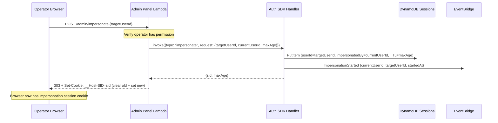
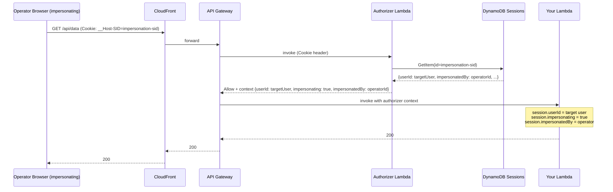
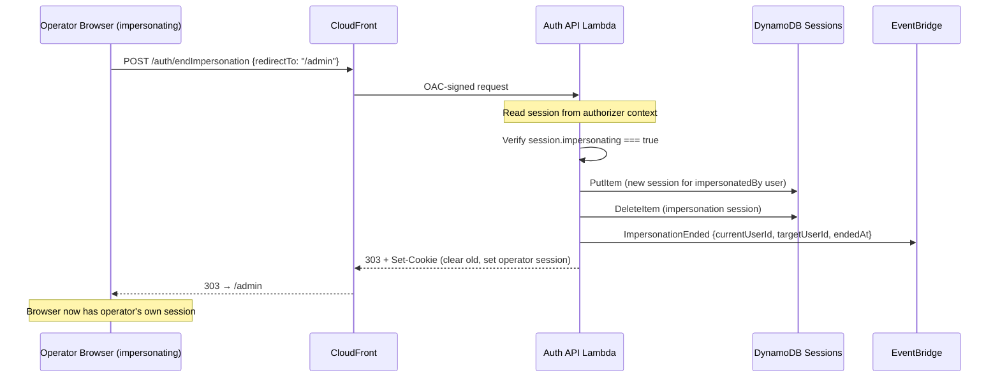
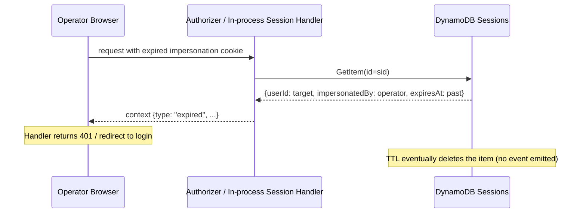

# Implementation Plan — Impersonation Feature

> **Last updated:** 2026-07-24 — aligned with `@beesolve/auth-service@0.11.0`
>
> **Reconciled after implementation:** `ImpersonationExpired` and the DynamoDB
> Streams approach were **dropped** — the feature ships only `ImpersonationStarted`
> and `ImpersonationEnded` (see ADR-010). Sections describing the expiry event,
> its stream Lambda, and the `impersonationExpiredEvents` CDK prop are marked
> **SUPERSEDED** below. Version bump is `0.15.1 → 0.16.0`; `endImpersonation`
> redirects with **303** (matching `signOut`), not 301.
>
> **Session model reworked (see ADR-012):** the impersonation session model
> described below (independent impersonation session; operator's original session
> left untouched with only its cookie swapped) was **superseded** for security.
> The shipped design instead: preserves the operator's original session as an
> **inactive server-side copy** under a new id (an `active` flag, default `true`,
> gates authorization; the exposed original id is burned by deleting the live
> row); caps the impersonation lifetime to `min(requested, maxImpersonationDuration,
originalExpiresAt − 5min)` so it always ends before the original would; stores
> an internal `originalSessionRef` on the impersonation row (never exposed to the
> client); and on `endImpersonation` restores the inactive copy if it still exists
> (else logs the operator out). The SDK `impersonate` command takes the operator's
> **cookie header** (not a bare id) and revalidates the session server-side. There
> is a single strict behavior — no `lax`/`strict` option. Design-decision and
> schema sections below that predate this are annotated **SUPERSEDED BY ADR-012**.

## Problem Statement

Operators (admins, support staff) need the ability to act as another user for debugging and support purposes. The current auth-service has no mechanism to create a session on behalf of another user while preserving an audit trail of who initiated it.

This plan adds impersonation support: an SDK command to start an impersonation session, a public auth endpoint to end it, new EventBridge events for audit, and a discriminated session context so downstream handlers can detect impersonation.

## Design Decisions

1. **`userId` stays as the effective user** — handlers that don't care about impersonation continue reading `session.userId` and work unchanged. The impersonation metadata is additive.

2. **Discriminated union in session context** — the valid session identity is `{ userId, impersonating: false }` or `{ userId, impersonating: true, impersonatedBy }`. Handlers pattern-match on `impersonating` to guard sensitive actions or show UI indicators. This applies to both the authorizer-based path (`getSessionContext()` / `createSessionHandle()`) and the in-process path (`createInProcessSessionHandle()` / `withSession()`).

3. **Flat `impersonatedBy` field in DynamoDB** — a single optional string on the session row. When absent → normal session. When present → the value is the account ID of whoever initiated the impersonation. The existing `userId` GSI still works (queries by effective user).

4. **SDK command to start, auth endpoint to end** — starting impersonation is a privileged server-to-server operation (SDK). Ending it is a browser action that needs to set a new cookie, so it's a public auth endpoint like `signOut`.

5. **Short-lived sessions** — impersonation sessions have a configurable max age (default 1 hour, max 4 hours) to limit exposure. **[SUPERSEDED BY ADR-012: lifetime is additionally capped to `originalExpiresAt − 5min` so impersonation never outlives the operator's own session.]**

6. **Authorization is the caller's responsibility** — the auth-service is an authentication layer. It doesn't know who is an "admin." The calling service must verify the operator has permission to impersonate before invoking the SDK command.

7. **Breaking change to session context** — `ValidSession` changes from `{ userId, sessionId, expiresAt }` to a discriminated union. This will be a minor version bump (0.15.1 → 0.16.0). All consumers must update their session reading code.

## DynamoDB Schema Change

> **SUPERSEDED BY ADR-012:** in addition to `impersonatedBy`, the shipped design
> adds an optional `active` attribute (default `true`; `false` marks the inactive
> preserved original copy, which the authorizer refuses) and an internal
> `originalSessionRef` attribute on the impersonation row pointing at the inactive
> copy. Both are optional (no migration).

No table or index changes. A single optional attribute is added to session items:

| Attribute        | Type     | Description                                                                                     |
| ---------------- | -------- | ----------------------------------------------------------------------------------------------- |
| `impersonatedBy` | `string` | Account ID of the user who initiated the impersonation. Only present on impersonation sessions. |

Existing sessions without this field are naturally the `impersonating: false` case — zero migration needed.

## Session Context Shape

The `validSession` object in the session context changes from a flat object to a discriminated union. This applies to both paths:

- **Authorizer-based** (`createSessionHandle()` / `getSessionContext()`): the authorizer Lambda serializes the session into the authorizer context JSON
- **In-process** (`createInProcessSessionHandle()` / `withSession()`): the session is resolved directly from DynamoDB

```ts
// Before (0.11.x)
type ValidSession = {
  userId: string;
  sessionId: string;
  expiresAt: string;
};

// After (0.16.0)
type ValidSession =
  | { userId: string; sessionId: string; expiresAt: string; impersonating: false }
  | {
      userId: string;
      sessionId: string;
      expiresAt: string;
      impersonating: true;
      impersonatedBy: string;
    };
```

Both the authorizer Lambda (`src/authorize.ts`) and the in-process authorizer (`sessionAuthorizer.ts`) build this by checking the session row:

```ts
// In authorize logic, after fetching the session:
const validSession =
  session.impersonatedBy != null
    ? {
        userId: session.userId,
        sessionId,
        expiresAt,
        impersonating: true as const,
        impersonatedBy: session.impersonatedBy,
      }
    : { userId: session.userId, sessionId, expiresAt, impersonating: false as const };
```

## SDK Command — `impersonate`

A new command added to the SDK handler. Only callable by Lambdas with `grantSdkAccess`.

### Request

```ts
type ImpersonateCommand = {
  type: "impersonate";
  request: {
    targetUserId: string; // the user to impersonate
    currentUserId: string; // who is initiating (the operator)
    maxAge?: number; // session lifetime in seconds (default 3600, max 14400)
  };
  response: {
    sid: string; // session cookie value to set on the response
    maxAge: number; // cookie max-age in seconds
  };
};
```

### Implementation

```ts
if (type === "impersonate") {
  const parsed = v.parse(impersonateSchema, request);

  const maxAge = Math.min(parsed.maxAge ?? 3600, 14400); // cap at 4 hours

  const session = await sessions.createOne({
    userId: parsed.targetUserId,
    maxAge,
    data: {},
    impersonatedBy: parsed.currentUserId,
  });

  await events.putEvents({
    type: "ImpersonationStarted",
    detail: {
      currentUserId: parsed.currentUserId,
      targetUserId: parsed.targetUserId,
      startedAt: new Date().toISOString(),
    },
  });

  return { sid: session.id, maxAge };
}
```

### SDK Client Usage

```ts
import { AuthClient } from "@beesolve/auth-service/sdk";

const auth = new AuthClient();

// Start impersonation (in your admin panel backend Lambda)
const { sid, maxAge } = await auth.invoke({
  type: "impersonate",
  request: {
    targetUserId: "user-to-impersonate-id",
    currentUserId: "operator-account-id", // from the operator's own session
    maxAge: 3600, // optional, 1 hour
  },
});

// Set the cookie on the response to the operator's browser
const response = new Response(null, {
  status: 303,
  headers: {
    Location: "/dashboard",
  },
});
addSetCookies({
  headers: response.headers,
  cookies: [{ sid, maxAge }],
});
```

## Auth Endpoint — `POST /auth/endImpersonation`

A public endpoint accessible from the browser. Creates a new session for the original operator and clears the impersonation session.

### Request

```json
{
  "redirectTo": "/admin/dashboard"
}
```

### Behavior

1. Read the current session from the `__Host-SID` cookie (via the authorizer context).
2. Verify the session has `impersonating: true`. If not → 400 Bad Request.
3. Create a new normal session for `impersonatedBy` (the operator).
4. Delete the impersonation session.
5. Emit `ImpersonationEnded` event.
6. Respond with 303 redirect + `Set-Cookie` (clear old, set new).

### Implementation

```ts
export async function endImpersonation({
  sessions,
  events,
  requestBody,
  session, // ValidSession from session context
  headers,
}: Dependencies): Promise<Response> {
  if (!session.impersonating) {
    throw new BadRequestError("Not in an impersonation session.");
  }

  const { redirectTo } = parseBody({ body: await requestBody(), schema });

  // Create a new session for the original operator
  const newSession = await sessions.createOne({
    userId: session.impersonatedBy,
    data: Sessions.dataFromCloudFrontHeaders(Object.fromEntries(headers.entries())),
  });

  // Delete the impersonation session
  await sessions.delete(session.sessionId);

  await events.putEvents({
    type: "ImpersonationEnded",
    detail: {
      currentUserId: session.impersonatedBy,
      targetUserId: session.userId,
      endedAt: new Date().toISOString(),
    },
  });

  const cookies = [
    { sid: session.sessionId, maxAge: -1 }, // clear impersonation cookie
    { sid: newSession.id, maxAge: newSession.maxAge }, // set operator's cookie
  ];

  // Content negotiation: JSON response for SPA clients, redirect for traditional apps
  const acceptsJson = headers.get("accept")?.includes("application/json");
  if (acceptsJson) {
    return new Response(JSON.stringify({ redirectTo: redirectTo ?? "/" }), {
      status: 200,
      headers: addSetCookies({
        headers: new Headers({
          "Content-Type": "application/json",
          "Cache-Control": "no-store",
        }),
        cookies,
      }),
    });
  }

  return new Response(null, {
    status: 303,
    headers: addSetCookies({
      headers: new Headers({
        "Cache-Control": "no-store",
        Location: redirectTo ?? "/",
      }),
      cookies,
    }),
  });
}
```

## EventBridge Events

Three new events added to the auth event bus:

> **SUPERSEDED:** `ImpersonationExpired` was dropped. Only the two events below
> are implemented — see ADR-010 and Resolved Decisions #1.

| `detail-type`          | Fired when                         | Key fields                                   |
| ---------------------- | ---------------------------------- | -------------------------------------------- |
| `ImpersonationStarted` | SDK `impersonate` command succeeds | `currentUserId`, `targetUserId`, `startedAt` |
| `ImpersonationEnded`   | `/auth/endImpersonation` completes | `currentUserId`, `targetUserId`, `endedAt`   |

### Event Schemas

```ts
interface ImpersonationStarted {
  readonly type: "ImpersonationStarted";
  readonly detail: {
    readonly currentUserId: string; // who initiated
    readonly targetUserId: string; // who is being impersonated
    readonly startedAt: string; // ISO timestamp
  };
}

interface ImpersonationEnded {
  readonly type: "ImpersonationEnded";
  readonly detail: {
    readonly currentUserId: string;
    readonly targetUserId: string;
    readonly endedAt: string;
  };
}
```

> **SUPERSEDED:** the `ImpersonationExpired` interface and the
> "`ImpersonationExpired` via DynamoDB Streams" subsection that followed were
> removed — the event is not implemented (ADR-010).

## Flows

### Start Impersonation



### Impersonated Request



### End Impersonation



### Impersonation Session Expires



> **SUPERSEDED:** the original diagram noted an optional
> `impersonationExpiredEvents` DynamoDB-stream path emitting `ImpersonationExpired`
> on TTL delete. That was dropped (ADR-010): a lapsed impersonation session is
> observed synchronously as `expired`, exactly like a normal session, and no
> expiry event is emitted.

## Handler Usage Examples

### Detecting impersonation in a handler (in-process pattern)

```ts
import { SessionAuthorizer, withSession } from "@beesolve/auth-service/sessionAuthorizer";

const authorizer = new SessionAuthorizer();

export const fetch = withSession(authorizer, async (request, session) => {
  // session.userId is always the effective user (the target)
  const data = await loadUserData(session.userId);

  if (session.impersonating) {
    // Log for audit, show banner, or restrict actions
    console.log(`Impersonated by ${session.impersonatedBy}`);
  }

  return new Response(JSON.stringify(data));
});
```

### Detecting impersonation in a SvelteKit hook

```ts
// hooks.server.ts
const authGuard: Handle = async ({ event, resolve }) => {
  const session = event.locals.session;

  if (session.type === "valid" && session.validSession.impersonating) {
    // Add impersonation indicator to page data
    event.locals.impersonatedBy = session.validSession.impersonatedBy;
  }

  return resolve(event);
};
```

### Blocking sensitive actions during impersonation

```ts
export const fetch = withSession(authorizer, async (request, session) => {
  if (session.impersonating) {
    return new Response(
      JSON.stringify({ message: "Cannot perform this action while impersonating." }),
      { status: 403, headers: { "Content-Type": "application/json" } },
    );
  }

  // ... delete account, change email, etc.
});
```

### Admin panel — starting impersonation

```ts
import { AuthClient } from "@beesolve/auth-service/sdk";
import { SessionAuthorizer, withSession } from "@beesolve/auth-service/sessionAuthorizer";
import { addSetCookies } from "@beesolve/auth-service";

const auth = new AuthClient();
const authorizer = new SessionAuthorizer();

export const fetch = withSession(authorizer, async (request, session) => {
  // Your own permission check — auth-service doesn't enforce this
  if (!(await isOperator(session.userId))) {
    return new Response("Forbidden", { status: 403 });
  }

  const { targetUserId } = await request.json();

  const { sid, maxAge } = await auth.invoke({
    type: "impersonate",
    request: {
      targetUserId,
      currentUserId: session.userId,
      maxAge: 3600,
    },
  });

  return new Response(null, {
    status: 303,
    headers: addSetCookies({
      headers: new Headers({
        "Cache-Control": "no-store",
        Location: "/",
      }),
      cookies: [
        { sid: session.sessionId, maxAge: -1 }, // clear operator's session
        { sid, maxAge }, // set impersonation session
      ],
    }),
  });
});
```

### Frontend — end impersonation button

```ts
async function endImpersonation() {
  await fetch("/auth/endImpersonation", {
    method: "POST",
    headers: { "Content-Type": "application/json" },
    body: JSON.stringify({ redirectTo: "/admin/users" }),
  });
  // Browser follows 303 redirect back to admin panel
}
```

## `withSession` and `SessionContext` Type Changes

The `ValidSession` type becomes a discriminated union. The `withSession` wrapper and `getSessionContext()` function continue working — they still reject invalid/expired sessions. But the type signature changes:

```ts
// Before (0.11.x)
export type ValidSession = {
  userId: string;
  sessionId: string;
  expiresAt: string;
};

// After (0.16.0)
export type ValidSession =
  | { userId: string; sessionId: string; expiresAt: string; impersonating: false }
  | {
      userId: string;
      sessionId: string;
      expiresAt: string;
      impersonating: true;
      impersonatedBy: string;
    };
```

This affects:

- `withSession(authorizer, handler)` in `sessionAuthorizer.ts` — the `session` param becomes the wider union
- `getSessionContext()` / `getSessionContextV2()` / `getSessionContextV1()` in `src/sessionContext.ts` — the `validSession` field within `SessionContext` becomes the wider union
- `createSessionHandle()` and `createInProcessSessionHandle()` in `sveltekit.ts` — `event.locals.session.validSession` becomes the wider union

Consumers that only access `session.userId` will continue working because `userId`, `sessionId`, `expiresAt` are present on both variants. The type error only appears if the consumer destructures or spreads the entire session object.

Upgrade paths:

1. **Pattern match** (recommended for handlers that care):

   ```ts
   if (session.impersonating) {
     // session.impersonatedBy available here
   }
   ```

2. **Access common fields directly** — `session.userId` still works without narrowing.

## Session Schema Changes (`session.ts` + `sessionContext.ts` + `sessionAuthorizer.ts`)

In `src/session.ts`, add the optional field to the DynamoDB item schema:

```ts
// Add to session schema:
impersonatedBy: v.optional(v.string()), // ← NEW
```

In `src/sessionContext.ts`, update `validSessionSchema`:

```ts
const validSessionSchema = v.variant("impersonating", [
  v.object({
    userId: v.string(),
    sessionId: v.string(),
    expiresAt: v.string(),
    impersonating: v.literal(false),
  }),
  v.object({
    userId: v.string(),
    sessionId: v.string(),
    expiresAt: v.string(),
    impersonating: v.literal(true),
    impersonatedBy: v.string(),
  }),
]);
```

In `sessionAuthorizer.ts`, update the `ValidSession` type to match:

```ts
export type ValidSession =
  | { userId: string; sessionId: string; expiresAt: string; impersonating: false }
  | {
      userId: string;
      sessionId: string;
      expiresAt: string;
      impersonating: true;
      impersonatedBy: string;
    };
```

In `src/authorize.ts`, build the discriminated context:

```ts
const validSession =
  session.impersonatedBy != null
    ? {
        userId,
        sessionId,
        expiresAt,
        impersonating: true as const,
        impersonatedBy: session.impersonatedBy,
      }
    : { userId, sessionId, expiresAt, impersonating: false as const };
```

`Sessions.createOne` gains an optional `impersonatedBy` param:

```ts
readonly createOne = async (props: {
  readonly userId: string;
  readonly maxAge?: number;
  readonly data: NewSession["data"];
  readonly impersonatedBy?: string; // ← NEW
}) => { /* ... */ };
```

## CDK Changes

Minimal — no new tables or indexes. Changes:

1. **Auth API Lambda** handles the new `/auth/endImpersonation` route (no CDK change, just code in the handler).
2. **Optional CDK prop** for configuring max impersonation duration:

```ts
/**
 * Maximum allowed impersonation session duration.
 * SDK callers can request up to this value. Defaults to 4 hours.
 *
 * @default Duration.hours(4)
 */
readonly maxImpersonationDuration?: Duration;
```

> **SUPERSEDED:** a third prop, `impersonationExpiredEvents?: boolean`, was
> planned to enable a DynamoDB Stream + Lambda emitting `ImpersonationExpired` on
> TTL delete. It was **not implemented** (ADR-010). No stream, no stream Lambda,
> no extra IAM grant, and no `impersonationExpiredEvents` prop exist. The Sessions
> table keeps its existing shape.

## Breaking Changes (0.15.1 → 0.16.0)

| Change                                           | Impact                                                                                                                             |
| ------------------------------------------------ | ---------------------------------------------------------------------------------------------------------------------------------- |
| `ValidSession` becomes a discriminated union     | All consumers reading session must handle or acknowledge the union. `session.userId` still accessible without narrowing.           |
| `withSession` handler signature                  | Same — receives `ValidSession` but type is wider now.                                                                              |
| Authorizer context JSON shape                    | Adds `impersonating` and optionally `impersonatedBy` fields. Existing consumers that only destructure known fields are unaffected. |
| `SessionContext.validSession` in SvelteKit hooks | Same union applies — `event.locals.session.validSession` is wider.                                                                 |

## Task Breakdown

### Task 1: Add `impersonatedBy` to session schema and `createOne`

- Add `impersonatedBy: v.optional(v.string())` to session DynamoDB schema
- Add optional `impersonatedBy` param to `Sessions.createOne` and `toNewSession`
- Include in `getOne` projection expression

### Task 2: Update authorize logic to build discriminated context

- In `src/authorize.ts`: read `impersonatedBy` from session row, build `validSession` as discriminated union
- In `sessionAuthorizer.ts`: update `ValidSession` type export to match
  <!-- SUPERSEDED: the planned "(Optional) Emit ImpersonationExpired on expired sessions" was dropped — the authorizer emits no expiry event (ADR-010). -->

### Task 3: Update `ValidSession` and `SessionContext` types

- Change `validSessionSchema` in `src/sessionContext.ts` to a `v.variant("impersonating", [...])` discriminated union
- Export updated `ValidSession` type
- Update `sveltekit.ts` dev fallback presets to include `impersonating: false`

### Task 4: Add `impersonate` SDK command

- Add schema, types, and handler logic in `sdkHandler.ts`
- Emit `ImpersonationStarted` event
- Enforce max age cap

### Task 5: Implement `/auth/endImpersonation` endpoint

- New handler `src/handlers/endImpersonation.ts`
- Wire into `api.ts` router
- Emit `ImpersonationEnded` event
- Return redirect with cookie swap (supports content negotiation: JSON `{ redirectTo }` when `Accept: application/json`, otherwise 303)

### Task 6: Add event types

- Add `ImpersonationStarted`, `ImpersonationEnded` to `src/events.ts` and consumer-facing `events.ts`
- Add type guards and schema validation
  <!-- SUPERSEDED: ImpersonationExpired was dropped from this task (ADR-010). -->

### Task 7: CDK changes

- Add `maxImpersonationDuration` prop, pass as env var to SDK handler
  <!-- SUPERSEDED: the planned optional `impersonationExpiredEvents` prop (DynamoDB Streams + expiry Lambda) was dropped (ADR-010). No stream or expiry Lambda was built. -->

### Task 8: Tests

- Unit test `impersonate` SDK command
- Unit test `endImpersonation` handler
- Unit test `authorize.ts` discriminated context building
- Unit test `withSession` with both variants
- Unit test SvelteKit handle with impersonation session

### Task 9: Update documentation

- Update README session middleware section
- Add impersonation section to README
- Update events table
- Update SDK client examples

## Checklist

- [x] Task 1: Session schema + `createOne` changes
- [x] Task 2: Authorizer context discrimination
- [x] Task 3: `ValidSession` / `SessionContext` type update
- [x] Task 4: `impersonate` SDK command
- [x] Task 5: `/auth/endImpersonation` endpoint
- [x] Task 6: Event types (Started, Ended — Expired dropped per ADR-010)
- [x] Task 7: CDK prop for max duration
- [x] Task 8: Tests
- [x] Task 9: Documentation update

## Resolved Decisions

1. **`ImpersonationExpired` event — REVERSED, not implemented.** This was originally planned via DynamoDB Streams (a Lambda subscribing to session-table TTL deletions, checking for `impersonatedBy`, emitting the event, gated behind an optional `impersonationExpiredEvents` CDK setting). That decision was **reversed** — see [ADR-010](../../packages/service-auth/docs/adr-010-no-impersonation-expiry-event.md). Rationale: TTL deletion latency is up to 48h, so the event would be far too late for audit or real-time use; and it would be asymmetric with normal-session expiry, which is not evented either (a lapsed impersonation session is simply observed as `expired` on the next request). No stream, no expiry Lambda, no `impersonationExpiredEvents` prop, and no `ImpersonationExpired` type/guard were built.

2. **`endImpersonation` routing** — reads `__Host-SID` directly from the cookie and looks up the session in DynamoDB within the handler. Same pattern as `signOut`. Stays on the auth function URL behind CloudFront OAC, no additional Lambda or API Gateway route needed.

3. **Session refresh** — impersonation sessions use the same refresh/rotation mechanism as normal sessions. Same 15s drift, same rotation logic. The max age cap (default 1h, max 4h) is enforced at creation time and carried through refreshes. No special-casing needed.
