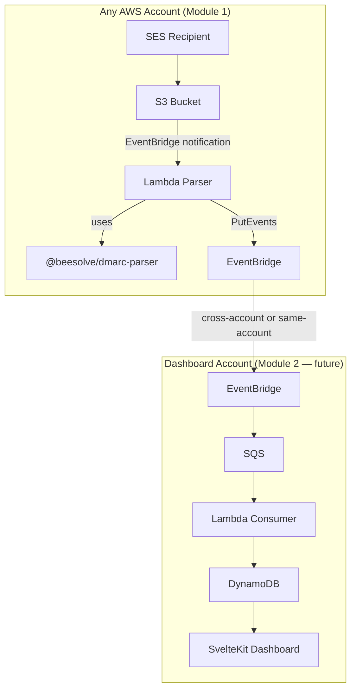

# DMARC Reports — Implementation Plan

## Problem Statement

Build a DMARC aggregate report ingestion pipeline: receive reports via SES, parse them, and emit structured events for downstream consumption (dashboard, alerting, persistence). Split into three packages for clean separation of concerns.

## Architecture



**Single-account default:** Module 1 emits to the account's default EventBridge bus. Module 2 listens on the same bus. Zero config.

**Multi-account:** Pass the dashboard account's EventBridge ARN to Module 1's CDK construct. Module 1 emits cross-account.

## Packages

### `@beesolve/dmarc-parser` — Pure parsing library

- Valibot schemas + exported TypeScript types for DMARC aggregate reports (RFC 7489)
- XML parsing (`fast-xml-parser` → validate → typed output)
- Decompression (`.gz` via `node:zlib`, `.zip` via built-in)
- MIME extraction (`mailparser` — extract attachment from raw email)
- **Zero AWS dependencies.** Publishable standalone, reusable by anyone.

### `@beesolve/dmarc-reports` — Collector infrastructure (Module 1)

- CDK construct: SES receipt rule → S3 → Lambda
- Lambda handler: fetch from S3 → use `@beesolve/dmarc-parser` → emit to EventBridge
- Construct props:
  - `recipient: string` — the email address receiving DMARC reports (required)
  - `eventBusArn?: string` — target EventBridge bus (defaults to account's default bus)
- Fire-and-forget. No persistence, no dashboard knowledge.
- Depends on `@beesolve/dmarc-parser` (workspace)

### `@beesolve/dmarc-dashboard` — Viewer (Module 2, future)

- Listens on EventBridge → SQS → consumer Lambda → DynamoDB
- SvelteKit dashboard via kit-on-lambda
- Auth via `@beesolve/auth-service`
- Owns the DynamoDB schema entirely (flat: one item per report)
- Uses `@beesolve/dmarc-parser` for types/schemas

## Dependencies

| Package                       | Used by       | Purpose                             | Notes                          |
| ----------------------------- | ------------- | ----------------------------------- | ------------------------------ |
| `fast-xml-parser`             | dmarc-parser  | XML → JS object                     | Zero deps, 40M+ downloads/week |
| `mailparser`                  | dmarc-parser  | MIME parsing to extract attachments | SES stores full MIME in S3     |
| `valibot`                     | dmarc-parser  | Schema validation                   | Already in catalog             |
| `@aws-sdk/client-s3`          | dmarc-reports | Fetch email from S3                 | Already in catalog             |
| `@aws-sdk/client-eventbridge` | dmarc-reports | Emit parsed reports                 | Already in catalog             |
| `aws-cdk-lib` / `constructs`  | dmarc-reports | CDK infrastructure                  | Already in catalog             |
| `@beesolve/cdk-constructs`    | dmarc-reports | `Nodejs24Function`                  | Workspace dependency           |

## Parsed Output Shape

```typescript
interface DmarcReport {
  reportMetadata: {
    orgName: string;
    email: string;
    reportId: string;
    dateRange: { begin: number; end: number };
    errors?: string[];
  };
  policyPublished: {
    domain: string;
    adkim: "r" | "s";
    aspf: "r" | "s";
    p: "none" | "quarantine" | "reject";
    sp?: "none" | "quarantine" | "reject";
    np?: "none" | "quarantine" | "reject";
    pct: number;
    fo?: string;
  };
  records: Array<{
    sourceIp: string;
    count: number;
    policyEvaluated: {
      disposition: "none" | "quarantine" | "reject";
      dkim: "pass" | "fail";
      spf: "pass" | "fail";
      reason?: Array<{ type: string; comment?: string }>;
    };
    identifiers: {
      headerFrom: string;
      envelopeFrom?: string;
      envelopeTo?: string;
    };
    authResults: {
      dkim: Array<{ domain: string; result: string; selector?: string }>;
      spf: Array<{ domain: string; result: string; scope?: string }>;
    };
  }>;
}
```

## Task Breakdown

### Phase 1: `@beesolve/dmarc-parser` ✅

#### Task 1: Scaffold the parser package ✅

- Create `packages/dmarc-parser/` with `package.json`, `tsconfig.json`, `index.ts`
- Add workspace entry, bunup config entry
- Dependencies: `fast-xml-parser`, `mailparser`, `valibot`
- Dev dependencies: `@types/mailparser`
- No AWS dependencies in this package
- Verify `bun install` and `bun run type-check` work
- **Demo:** Package exists, installs cleanly, type-checks

#### Task 2: Define Valibot schemas for full RFC 7489 aggregate report ✅

- Create `src/schema.ts` with Valibot schemas covering the full DMARC aggregate report XML structure
- Include all optional fields: `errors`, `np`, `fo`, `reason`, `envelope_to`, `envelope_from`, `version`, `extra_contact_info`
- Export inferred TypeScript types (`DmarcReport`, `DmarcRecord`, etc.)
- Write tests with synthetic data (RFC 2606 domains) validating against the schemas
- **Demo:** `bun test` passes, schemas validate correctly

#### Task 3: Build the XML parser ✅

- Create `src/parseXml.ts` — takes XML string, uses `fast-xml-parser` to parse, validates against Valibot schema, returns typed `DmarcReport`
- Handle `fast-xml-parser` quirks: normalize single objects to arrays for `record`, `dkim`, `spf`, `reason`, `error`
- Write tests using the compressed samples from `samples/` (gitignored, under `packages/dmarc-parser/samples/`) — decompress in-test, parse, validate
- Tests skip gracefully if `samples/` directory is missing
- **Demo:** `bun test` passes, all 87 sample files parse correctly to typed objects

#### Task 4: Build the decompression + MIME extraction layer ✅

- Create `src/decompress.ts` — handles `.gz` (`node:zlib` gunzipSync) and `.zip` (extract XML file from zip archive)
- Create `src/extractFromEmail.ts` — takes raw MIME email buffer, uses `mailparser` to find `.gz`/`.zip`/`.xml` attachments, decompresses, returns XML string(s)
- Write tests: synthetic MIME email with gzipped XML attachment, direct `.gz` buffer, direct `.zip` buffer
- **Demo:** `bun test` passes, all extraction paths work

#### Task 5: Integration test with real samples ✅

- Create a test that reads all 87 files from `packages/dmarc-parser/samples/`, decompresses each, parses XML, validates through schema
- Log summary: total parsed, providers seen, any failures
- Skip if `samples/` is missing
- Ensure `bun run build`, `bun run type-check`, `bun run lint`, `bun run fmt:check` all pass
- **Demo:** All 87 samples parse successfully, package builds cleanly

### Phase 2: `@beesolve/dmarc-reports`

#### Task 6: Scaffold the reports package

- Create `packages/dmarc-reports/` structure (note: `plan.md` and `samples/` already exist here)
- `package.json`, `tsconfig.json`, `index.ts`, `cdk.ts`
- Dependencies: `@beesolve/dmarc-parser` (workspace), `@aws-sdk/client-s3`, `@aws-sdk/client-eventbridge`, `@beesolve/cdk-constructs` (workspace)
- Add bunup config entry
- **Demo:** Package exists, installs, type-checks

#### Task 7: Lambda handler

- Create `src/handler.ts` — Lambda triggered by S3 EventBridge notification
- Flow: receive S3 event → fetch object from S3 → use `@beesolve/dmarc-parser` to extract + parse → emit `PutEvents` to EventBridge with parsed report as detail
- EventBridge event: `source: "dmarc-reports"`, `detail-type: "DmarcReportParsed"`, `detail: <DmarcReport>`
- Also `console.log` the parsed report (CloudWatch visibility)
- Create `build.ts` to pre-build handler with esbuild (same pattern as `service-email`)
- Add `prepublishOnly` script
- Write integration test mocking S3 + EventBridge clients
- **Demo:** `bun test` passes, handler processes mock event end-to-end

#### Task 8: CDK construct

- Create `cdk.ts` — CDK construct `DmarcReports`:
  - S3 bucket (lifecycle: 90 days, SSL enforced, block public access, EventBridge notifications enabled)
  - SES `ReceiptRuleSet` with rule for configured recipient → S3 action (`objectKeyPrefix: "inbox/"`)
  - Lambda (using `Nodejs24Function` with pre-built handler)
  - EventBridge rule: S3 object created in bucket → Lambda
  - IAM: Lambda reads S3, Lambda puts events to EventBridge
  - Props: `recipient` (required), `eventBusArn` (optional, defaults to default bus)
- Add `cdk` export to package.json
- Write CDK template assertion test
- **Demo:** `bun test` passes, construct synthesizes valid CloudFormation

#### Task 9: End-to-end validation

- Ensure both packages build: `bun run build`
- Ensure `bun run type-check`, `bun run lint`, `bun run fmt:check` pass
- Verify dependency order in `dependencies.json` after running `bun run recalculate-dependencies`
- **Demo:** Both packages build and pass all checks, ready for deployment

## Notes

- The `samples/` directory under `packages/dmarc-parser/` is gitignored — contains real DMARC reports and must not be committed
- Tests depending on `samples/` skip gracefully if the directory is missing
- No real domain names, email addresses, or IP addresses in source code or committed test fixtures — use RFC 2606 reserved domains (`example.com`, `example.org`) and documentation IPs (`192.0.2.x`, `198.51.100.x`)
- Samples include `.zip` (Google, emailsrvr.com) and `.xml.gz` (Microsoft, Yahoo, Comcast, AOL, Sky, Cox, Rocketmail) formats

## Design Decisions

### Why EventBridge as the output (not DynamoDB directly)

Module 1 (collector) is fire-and-forget. If it wrote directly to DynamoDB, the DynamoDB model/connection code would need to be shared between the collector and the dashboard — creating a coupling between independently deployable modules. With EventBridge:

- Module 1 emits a structured event and is done
- Module 2 owns persistence entirely (schema, table, indexes)
- No shared database dependency between modules
- Adding new consumers (alerting, analytics) requires zero changes to Module 1

### DynamoDB schema (owned by `@beesolve/dmarc-dashboard`)

**Access patterns:**

1. Get all reports for a domain, sorted by date (dashboard timeline)
2. Get reports from a specific reporting org (e.g., "all Google reports")
3. Find failures (disposition != "none") for alerting
4. Filter by date range

**Flat single-item-per-report design:**

| PK                | SK                                 | Attributes                |
| ----------------- | ---------------------------------- | ------------------------- |
| `domain#<domain>` | `<timestamp>#<orgName>#<reportId>` | Full `DmarcReport` object |

- Timestamp first in SK → queries are naturally sorted by date
- Query all reports for a domain in a time range with `begins_with` + between on SK
- At expected volume (~5-10 reports/day per domain), well within 400KB item limit
- Can decompose into per-record items later if volume grows

**Failure detection:** No separate index needed. Each report item contains the full `records` array with disposition/dkim/spf results. At expected volume, query by domain + time range and filter for failures in application code (or add a top-level `hasFailures` boolean attribute for simple `FilterExpression` if needed later).

**Model validation:** Valibot schema for DynamoDB items, same pattern as `@beesolve/action-tokens` — validate on read, parse before write.

### Single-account vs multi-account deployment

**Single account (default, zero config):**

- Module 1 emits to the account's default EventBridge bus
- Module 2 listens on the same default bus via SQS
- One CDK app, one `cdk deploy`, done

**Multi-account:**

- Module 1's CDK construct accepts optional `eventBusArn` prop
- When provided, Lambda emits cross-account to the dashboard's EventBridge bus
- Dashboard's bus has a resource policy allowing source accounts
- Each new source account deployment just needs the dashboard bus ARN (can come from SSM Parameter Store or mise env var)
- No circular dependency — the dashboard bus ARN is stable once created

### Multi-project / multi-domain support

Different DMARC recipient addresses (one per project/domain) all route through their own Module 1 instance. The parsed EventBridge event includes the `policyPublished.domain` field, so the dashboard naturally groups by domain. No special routing or prefix logic needed — the domain is in the data itself.

### Why not use `dmarc-report-parser` npm package

- Last published 3 years ago (v0.1.5), 358 downloads/week, 6 dependencies
- The XML structure is simple (~30-40 fields across 8 nested objects)
- Writing our own with `fast-xml-parser` + Valibot gives us full control over types, validation rules, and error messages
- Approximately 50-100 lines of parsing code — not worth the dependency risk

## Future Phases

### Phase 3: `@beesolve/dmarc-dashboard`

- EventBridge → SQS → consumer Lambda → DynamoDB (flat: one item per report)
- DynamoDB schema: `PK: domain#<domain>`, `SK: <timestamp>#<orgName>#<reportId>`
- Valibot-validated model (same pattern as `@beesolve/action-tokens`)
- SvelteKit dashboard via kit-on-lambda
- Auth via `@beesolve/auth-service`
- Views: timeline, per-source breakdown, pass rates, failure alerts
- Filter by date range, reporting org, domain

### Phase 4: Multi-account support

- Module 1 accepts `eventBusArn` prop pointing to dashboard account's bus
- Cross-account EventBridge resource policy on dashboard bus allows source accounts
- Dashboard's SQS consumer processes events from all source accounts
- Source management UI in dashboard (add/remove source accounts)

### Phase 5: Alerting

- Detect failures (disposition != "none", unknown source IPs)
- Notify via `@beesolve/email-service` or SNS
- Configurable thresholds per domain
