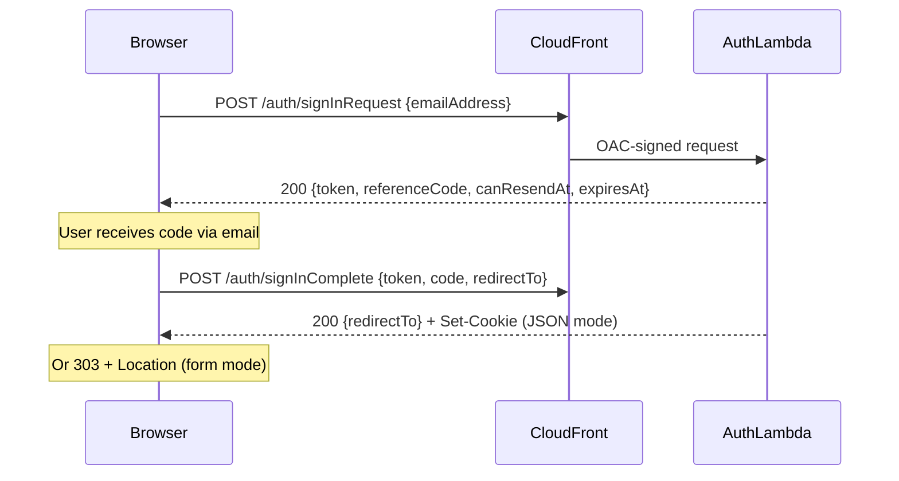

# @beesolve/auth-service

Passwordless email-code authentication for AWS. Cookie-based, same-domain, serverless.

- **Cookie-based** — session lives in a `__Host-SID` cookie, no tokens in frontend code
- **Same-domain** — frontend, auth endpoints, and API all behind one CloudFront distribution
- **AWS-native & serverless** — DynamoDB, Lambda, CloudFront, EventBridge, API Gateway
- **Framework-agnostic** — works with any frontend (SPA or SSR), first-class SvelteKit support

## What This Is

A self-contained auth microservice you deploy into your AWS account via CDK. It handles:

1. Email → OTP code generation → EventBridge event (you send the email)
2. Passkeys (WebAuthn) → biometric/PIN sign-in without codes or emails
3. Code verification → session creation → `__Host-SID` cookie set
4. Session validation on every request (via Lambda authorizer or in-process)
5. Session refresh & rotation (transparent to the client)
6. Sign-out → session invalidation

## What This Is NOT

- **Not an identity provider** — no OAuth, OIDC, SAML, or federation
- **Not SSO** — sessions are scoped to a single domain/application
- **Not a user management system** — no profiles, roles, permissions, or password resets
- **Not multi-tenant** — single flat account table, no organizations
- **Not a hosted service** — you deploy and own the infrastructure
- **Not cross-domain** — the `__Host-` cookie prefix means it only works on the exact origin that set it

If you need OAuth/OIDC/SAML or cross-domain SSO, use Cognito, Auth0, or similar. This package is for applications that want simple, self-owned, passwordless auth on a single domain.

## Installation

Install with your preferred package manager:

```sh
npm install @beesolve/auth-service
# or
bun add @beesolve/auth-service
```

## Architecture

```
┌─────────────────────────────────────────────────────────────────┐
│                     CloudFront Distribution                     │
│                        app.example.com                          │
├──────────────┬─────────────────────┬────────────────────────────┤
│  /auth/*     │  /api/*             │  /*                        │
│  OAC→Lambda  │  API Gateway        │  S3 or Lambda (your app)   │
│  Function URL│  + Authorizer       │                            │
└──────┬───────┴──────────┬──────────┴────────────────────────────┘
       │                  │
       ▼                  ▼
  Auth Handler      Your Lambda(s)
  (sign-in/out)     (authorized by session cookie)
       │
       ▼
  EventBridge ──→ Your email consumer
```

Everything runs on a single domain. The browser includes `__Host-SID` automatically on every request — no CORS, no token management, no `Authorization` headers.

## CDK Setup

The package exports two CDK constructs from `@beesolve/auth-service/cdk`:

| Construct     | Use case                                                                                                                             |
| ------------- | ------------------------------------------------------------------------------------------------------------------------------------ |
| `AuthGateway` | Includes an HTTP API Gateway with Lambda authorizer. Use for SPA backends or SSR apps that want authorizer-based session validation. |
| `AuthService` | Auth endpoints only (no API Gateway). Use for SSR apps doing in-process session resolution.                                          |

### AuthGateway (recommended for SPAs)

```ts
import { AuthGateway } from "@beesolve/auth-service/cdk";

const auth = new AuthGateway(this, "Auth", {
  stage: "prod",
  frontendUri: "https://app.example.com",
  allowSignUp: true,
});

// Add your API behind the session authorizer.
// Path defaults to "/api/{proxy+}" — override with `path` if needed.
auth.addAuthorizedEndpoint({ lambda: apiHandler });

// Grant SDK access to any Lambda that needs to manage accounts/sessions
auth.grantSdkAccess(apiHandler);
```

### AuthService (recommended for SSR)

```ts
import { AuthService } from "@beesolve/auth-service/cdk";

const auth = new AuthService(this, "Auth", {
  stage: "prod",
  frontendUri: "https://app.example.com",
  allowSignUp: true,
});

// Your SSR handler resolves sessions directly from DynamoDB
auth.grantSessionAuthorizerAccess(handler);
auth.grantSdkAccess(handler);
```

### CloudFront wiring

Both constructs provide `authBehavior` (or `createAuthBehavior(scope)` for cross-stack) to add the `/auth/*` behavior to your CloudFront distribution:

```ts
// auth = AuthGateway or AuthService instance from the examples above
distribution.addBehavior("/auth/*", auth.authBehavior.origin, auth.authBehavior);
```

### Authorizer cache presets (AuthGateway only)

| Preset        | Cache TTL                    | Behavior                                                          |
| ------------- | ---------------------------- | ----------------------------------------------------------------- |
| `"immediate"` | 0s                           | No cache. Sign-out takes effect instantly.                        |
| `"balanced"`  | 45s                          | Default. Good balance of cost and freshness.                      |
| `"relaxed"`   | 1h                           | Lowest cost. Sign-out delayed up to 1h.                           |
| `"disabled"`  | No cache, no identity source | Required when requests without cookies must reach the authorizer. |

### CDK Props

| Prop                            | Type                      | Description                                                                                      |
| ------------------------------- | ------------------------- | ------------------------------------------------------------------------------------------------ |
| `stage`                         | `string`                  | Environment name. `"prod"` enables deletion protection and PITR.                                 |
| `frontendUri`                   | `string`                  | Your application URL (used as base URI in events).                                               |
| `allowSignUp`                   | `boolean`                 | Auto-create accounts on first sign-in.                                                           |
| `eventBusArn`                   | `string?`                 | Custom EventBridge bus ARN. Defaults to `default`.                                               |
| `appId`                         | `string?`                 | Scopes events to this app: source becomes `beesolve.auth.<appId>` (default `beesolve.auth.api`). |
| `dataToken`                     | `boolean?`                | Read `__Host-DataToken` cookie and emit `DataToken` event on sign-in.                            |
| `sessionDuration`               | `Duration?`               | Session lifetime. Default 30 days.                                                               |
| `otpExpiry`                     | `Duration?`               | OTP code validity. Default 10 minutes.                                                           |
| `resendCooldown`                | `Duration?`               | Minimum time between resends. Default 60s.                                                       |
| `drainOnResend`                 | `boolean?`                | Invalidate previous OTP on resend. Default `true`.                                               |
| `encryptionKey`                 | `IKey?`                   | Customer-managed KMS key for DynamoDB and SQS.                                                   |
| `alarms`                        | `EmailAlarms?`            | `@beesolve/cdk-email-alarms` instance for error monitoring.                                      |
| `warmer`                        | `LambdaKeepActive?`       | Keep handler Lambdas warm.                                                                       |
| `waf`                           | `{ rateLimit?: number }?` | WAF rate limiting rule group.                                                                    |
| `logGroupProps`                 | `LogGroupProps?`          | Override Lambda log group settings.                                                              |
| `contributorInsights`           | `boolean?`                | DynamoDB Contributor Insights. Default `true` in prod.                                           |
| `authorizerReservedConcurrency` | `number?`                 | Authorizer Lambda reserved concurrency.                                                          |
| `sdkHandlerReservedConcurrency` | `number?`                 | SDK handler Lambda reserved concurrency.                                                         |
| `authorizerCache`               | preset or `Duration`      | Authorizer cache behavior (AuthGateway only). Default `"balanced"`.                              |
| `accessLogging`                 | `boolean?`                | API Gateway access logging (AuthGateway only). Default `true` in prod.                           |
| `rpId`                          | `string?`                 | Relying Party ID for passkeys (your domain). Enables `/auth/passkey/*` endpoints.                |
| `rpName`                        | `string?`                 | Relying Party display name for passkeys. Default `"Auth"`.                                       |

## Auth Flow



All endpoints: `POST`. Accepts both `Content-Type: application/json` and `application/x-www-form-urlencoded`.

### Endpoints

**POST /auth/signInRequest**

```ts
const { token, referenceCode, canResendAt, expiresAt } = await fetch("/auth/signInRequest", {
  method: "POST",
  headers: { "Content-Type": "application/json" },
  body: JSON.stringify({ emailAddress: "user@example.com" }),
}).then((r) => r.json());
```

Emits `EmailCodeAuth` event. Your consumer sends the email.

**POST /auth/resendCode**

```ts
const {
  token: newToken,
  referenceCode,
  canResendAt,
  expiresAt,
} = await fetch("/auth/resendCode", {
  method: "POST",
  headers: { "Content-Type": "application/json" },
  body: JSON.stringify({ token }),
}).then((r) => r.json());
```

Returns 429 if called before cooldown. Previous token is drained by default.

**POST /auth/signInComplete**

```ts
const res = await fetch("/auth/signInComplete", {
  method: "POST",
  headers: { "Content-Type": "application/json", Accept: "application/json" },
  body: JSON.stringify({ token, code: "123456", redirectTo: "/dashboard" }),
  credentials: "include",
});
const { redirectTo } = await res.json();
window.location.href = redirectTo;
// → 200 JSON with redirectTo, __Host-SID and aSID cookies set
// Without Accept: application/json → 303 redirect (for native form submissions)
```

**POST /auth/signOut**

```ts
const res = await fetch("/auth/signOut", {
  method: "POST",
  headers: { "Content-Type": "application/json", Accept: "application/json" },
  body: JSON.stringify({ redirectTo: "/" }),
  credentials: "include",
});
const { redirectTo } = await res.json();
window.location.href = redirectTo;
// → 200 JSON with redirectTo, cookies cleared
// Without Accept: application/json → 303 redirect (for native form submissions)
```

## Integration Patterns

### Pattern 1: SPA + Lambda Authorizer

Static frontend (S3/CloudFront) with a separate API Lambda behind API Gateway. Best for React, Vue, Angular, or any SPA.

```ts
// CDK
const auth = new AuthGateway(this, "Auth", { stage, frontendUri, allowSignUp: true });
auth.addAuthorizedEndpoint({ lambda: apiHandler }); // defaults to /api/{proxy+}
```

**How it works:** The SPA calls `/auth/*` for sign-in (same domain, cookies set automatically). API calls to `/api/*` include the cookie; the Lambda authorizer validates the session. If the session is invalid, API Gateway returns the authorizer context with `type: "invalid"` — your handler returns 401.

**Client-side auth detection via `aSID`:**

```ts
// aSID is a non-HttpOnly companion cookie: "1" when logged in, "0" when not
function isAuthenticated(): boolean {
  return document.cookie.includes("aSID=1");
}

// Route guard
if (!isAuthenticated()) router.replace("/sign-in");
```

> `aSID` is a UI hint, not a security boundary. Actual enforcement happens server-side.

### Pattern 2: SSR + Lambda Authorizer + CloudFront Function

SvelteKit (or any SSR framework) on Lambda. The authorizer validates sessions; a CloudFront Function injects `__Host-SID=anonym` on cookieless requests so the authorizer's `identitySource` is always satisfied.

```ts
// CDK
const auth = new AuthGateway(this, "Auth", { stage, frontendUri, allowSignUp: true });
auth.addAuthorizedEndpoint({ lambda: svelteHandler, path: "/{proxy+}" });

// Attach ensureCookieFunction to the default behavior
const cfnDist = distribution.node.defaultChild as CfnDistribution;
cfnDist.addPropertyOverride("DistributionConfig.DefaultCacheBehavior.FunctionAssociations", [
  { EventType: "viewer-request", FunctionARN: auth.ensureCookieFunction.functionArn },
]);
```

```ts
// hooks.server.ts
import { createSessionHandle } from "@beesolve/auth-service/sveltekit";
export const handle = sequence(createSessionHandle(), authGuard);
```

### Pattern 3: SSR + In-process session resolution (recommended for SSR)

SvelteKit on Lambda. The handler resolves sessions from DynamoDB directly — no authorizer Lambda, single invocation per request, lowest latency.

```ts
// CDK — using AuthGateway (when you also need API Gateway for other routes)
const auth = new AuthGateway(this, "Auth", { stage, frontendUri, allowSignUp: true });
auth.addPublicEndpoint({ lambda: handler });
auth.grantSessionAccess(handler); // grants DynamoDB access for in-process session resolution
auth.grantSdkAccess(handler);

// CDK — using AuthService (no API Gateway at all)
const auth = new AuthService(this, "Auth", { stage, frontendUri, allowSignUp: true });
auth.grantSessionAuthorizerAccess(handler); // equivalent to grantSessionAccess on AuthGateway
auth.grantSdkAccess(handler);
```

```ts
// hooks.server.ts
import { createInProcessSessionHandle } from "@beesolve/auth-service/sveltekit";
import { redirect, type Handle } from "@sveltejs/kit";
import { sequence } from "@sveltejs/kit/hooks";

const publicPaths = new Set(["/sign-in", "/sign-in/verify", "/sign-out"]);

const authGuard: Handle = async ({ event, resolve }) => {
  if (event.locals.session.type !== "valid" && !publicPaths.has(event.url.pathname)) {
    redirect(303, "/sign-in");
  }
  return resolve(event);
};

export const handle = sequence(createInProcessSessionHandle(), authGuard);
```

> **Vite config:** Add `@beesolve/lambda-fetch-api` to SSR externals to avoid `AsyncLocalStorage` deduplication:
>
> ```ts
> export default defineConfig({
>   plugins: [sveltekit()],
>   ssr: { external: ["@beesolve/lambda-fetch-api"] },
> });
> ```

### Pattern 4: Non-SvelteKit SSR / Custom handler

Use `SessionAuthorizer` from `@beesolve/auth-service/sessionAuthorizer` directly:

```ts
import { SessionAuthorizer, withSession } from "@beesolve/auth-service/sessionAuthorizer";

const authorizer = new SessionAuthorizer();

// Option A: withSession wrapper — rejects unauthenticated requests with 401 automatically
export const handler = withSession(authorizer, async (request, session) => {
  // session is guaranteed valid here (userId, sessionId, expiresAt)
  return new Response(JSON.stringify({ userId: session.userId }));
});

// Option B: manual control inside your own handler for mixed public/protected routes
export async function handler(request: Request): Promise<Response> {
  const result = await authorizer.authorize(request.headers);

  if (result.type !== "valid") {
    return new Response("Unauthorized", { status: 401 });
  }

  return new Response(JSON.stringify({ userId: result.validSession.userId }));
}
```

Requires `grantSessionAuthorizerAccess(handler)` (or `grantSessionAccess` on `AuthGateway`) on the CDK construct.

## Session Middleware (API Gateway pattern)

When using `AuthGateway` with `addAuthorizedEndpoint`, your handler receives session state via the authorizer context:

```ts
import { addSetCookies, getSessionContext } from "@beesolve/auth-service";

export async function handler(request: Request, resHeaders: Headers): Promise<Response> {
  const session = await getSessionContext();

  // Forward session refresh cookies to the response
  if (session.type !== "none") {
    addSetCookies({ headers: resHeaders, cookies: session.setCookiesParams });
  }

  if (session.type !== "valid") {
    return new Response("Unauthorized", { status: 401 });
  }

  return new Response(JSON.stringify({ userId: session.validSession.userId }));
}
```

The authorizer always returns `Allow` — session state (`"valid"`, `"expired"`, `"invalid"`) is passed as context. This lets handlers differentiate between anonymous, expired, and authenticated requests.

### tRPC example

```ts
import { addSetCookies, getSessionContext } from "@beesolve/auth-service";
import type { FetchCreateContextFnOptions } from "@trpc/server/adapters/fetch";

export async function createContext({ resHeaders }: FetchCreateContextFnOptions) {
  const session = await getSessionContext();
  const userId = session.type === "valid" ? session.validSession.userId : null;
  return {
    resHeaders: addSetCookies({ headers: resHeaders, cookies: session.setCookiesParams }),
    userId,
  };
}
```

## SDK Client

Use `AuthClient` from `@beesolve/auth-service/sdk` in Lambdas granted access via `grantSdkAccess`:

```ts
import { AuthClient } from "@beesolve/auth-service/sdk";

const auth = new AuthClient();

// Look up account by email
const result = await auth.invoke({
  type: "accountIdByEmail",
  request: { emailAddress: "user@example.com" },
});
// → { id: string } | null

// Create account
const { id } = await auth.invoke({
  type: "newEmailAccount",
  request: { emailAddress: "new@example.com" },
});

// List active sessions
const sessions = await auth.invoke({ type: "sessionList", request: { accountId: id } });

// Delete all sessions (force sign-out everywhere)
await auth.invoke({
  type: "deleteAllSessions",
  request: { accountId: id, exceptSessionId: "keep-this" },
});
```

## EventBridge Events

All events are emitted on the configured bus with source `beesolve.auth.api` (or `beesolve.auth.<appId>` when `appId` is set).

| Event                  | When                                    | Key fields                                                                   |
| ---------------------- | --------------------------------------- | ---------------------------------------------------------------------------- |
| `EmailCodeAuth`        | Sign-in requested / code resent         | `accountId`, `code`, `expiresAt`, `emailAddress`, `referenceCode`, `baseUri` |
| `EmailAddressVerified` | New account created (first sign-in)     | `accountId`, `emailAddress`, `verifiedAt`                                    |
| `DataToken`            | Sign-in complete with `dataToken: true` | `accountId`, `emailAddress`, `dataToken`                                     |
| `SuccessfulAuth`       | Sign-in succeeded                       | `userId`                                                                     |
| `UnsuccessfulAuth`     | Sign-in failed (invalid/expired code)   | `emailAddress`, `reason`                                                     |
| `SessionInvalidated`   | Sign-out                                | `sessionId`                                                                  |
| `PasskeyRegistered`    | New passkey credential stored           | `userId`, `credentialId`                                                     |
| `PasskeyAuthUsed`      | Successful passkey sign-in              | `userId`, `credentialId`                                                     |

> **You must subscribe to `EmailCodeAuth` and send the email yourself.** Use `@beesolve/email-service` or any email provider. See the `authWithEmail` sample for a complete implementation.

### Consuming events

```ts
import type { SQSEvent } from "aws-lambda";
import { parseAuthEvent, isEmailCodeAuth, isUnsuccessfulAuth } from "@beesolve/auth-service/events";

export async function handler(event: SQSEvent): Promise<void> {
  for (const record of event.Records) {
    const authEvent = parseAuthEvent(record.body);
    if (authEvent == null) continue;

    if (isEmailCodeAuth(authEvent)) {
      await sendVerificationEmail({
        to: authEvent.detail.emailAddress,
        code: authEvent.detail.code,
        referenceCode: authEvent.detail.referenceCode,
        expiresAt: authEvent.detail.expiresAt,
      });
    }

    if (isUnsuccessfulAuth(authEvent)) {
      console.warn(`Failed sign-in: ${authEvent.detail.reason}`);
    }
  }
}
```

## Local Development

### SvelteKit

`createSessionHandle` and `createInProcessSessionHandle` auto-detect Lambda vs local. Locally, they inject a dev session:

```ts
import {
  createSessionHandle,
  devValidSession, // default — logged in as "dev-user"
  devInvalidSession, // no session cookie
  devExpiredSession, // expired session
  devNoneSession, // authorizer didn't run
} from "@beesolve/auth-service/sveltekit";

// Simulate expired session
export const handle = sequence(
  createSessionHandle({ fallbackSession: devExpiredSession }),
  authGuard,
);
```

> **Running under `kit-on-lambda`?** See
> [how-to: Running auth-service with kit-on-lambda locally](./docs/how-to/local-development-with-kit-on-lambda.md)
> for the full end-to-end setup — mapping the dev session to a real user, loading
> `.env.local`, and the required Vite SSR-externals config.

### Non-SvelteKit (Bun/Node server)

Use `withDevSession` to wrap your fetch handler with a fake API Gateway context so `getSessionContext` works locally:

```ts
import { serve } from "bun";
import { withDevSession } from "@beesolve/auth-service/dev";
import { myApiHandler } from "./api";

const devApi = withDevSession(myApiHandler, { userId: "dev-user-123" });

serve({
  port: 3000,
  routes: {
    "/api/*": (request) => devApi(request),
  },
});
```

## Samples

See [`packages/samples`](../samples/) for deployable reference implementations:

| Sample                | Pattern          | Description                                                      |
| --------------------- | ---------------- | ---------------------------------------------------------------- |
| `authEmailSimple`     | SSR + in-process | Minimal auth, session check in SvelteKit hooks                   |
| `authEmailAuthorizer` | SSR + authorizer | Session validation via Lambda authorizer                         |
| `authWithEmail`       | SSR + in-process | Full auth with real email delivery via `@beesolve/email-service` |

## Passkeys (WebAuthn)

Passkeys provide passwordless, phishing-resistant authentication using the Web Authentication API. Users authenticate with biometrics (fingerprint, face), device PIN, or hardware security keys — no codes or emails required.

### Enabling Passkeys

Pass `rpId` to the CDK construct to enable passkey endpoints:

```ts
const auth = new AuthGateway(this, "Auth", {
  stage: "prod",
  frontendUri: "https://app.example.com",
  allowSignUp: true,
  rpId: "app.example.com", // your domain without port
  rpName: "My App", // display name shown in authenticator prompts
});
```

When `rpId` is not set, all `/auth/passkey/*` endpoints return 404 (feature disabled).

### How It Works

Passkeys coexist with email OTP — users can have both. A user who signed up via email can add a passkey later (while authenticated). Passkey sign-in is fully independent of email and doesn't require an existing email account.

Credentials are stored in the same accounts table as email accounts, with `type: "passkey"` and the credential ID as the sort key.

### Passkey Endpoints

| Endpoint                              | Auth Required | Purpose                                                       |
| ------------------------------------- | ------------- | ------------------------------------------------------------- |
| `POST /auth/passkey/registerOptions`  | ✅ Yes        | Generate registration options (challenge, rp info, user info) |
| `POST /auth/passkey/registerComplete` | ✅ Yes        | Verify attestation response, store credential                 |
| `POST /auth/passkey/authOptions`      | ❌ No         | Generate authentication options (challenge, rpId)             |
| `POST /auth/passkey/authComplete`     | ❌ No         | Verify assertion response, create session                     |

### Registration Flow (adding a passkey to an existing account)

The user must already be authenticated (via email OTP or another passkey).

```ts
// 1. Get registration options from the server
const optionsRes = await fetch("/auth/passkey/registerOptions", {
  method: "POST",
  headers: { "Content-Type": "application/json" },
  body: JSON.stringify({ displayName: "Ivan's MacBook" }), // optional
  credentials: "include",
});
const { token, publicKey } = await optionsRes.json();

// 2. Call WebAuthn API — browser shows biometric/PIN prompt
// Note: challenge and user.id must be decoded from base64url to ArrayBuffer
const credential = await navigator.credentials.create({
  publicKey: {
    ...publicKey,
    challenge: base64urlToBuffer(publicKey.challenge),
    user: {
      ...publicKey.user,
      id: base64urlToBuffer(publicKey.user.id),
    },
    excludeCredentials: publicKey.excludeCredentials.map((cred) => ({
      ...cred,
      id: base64urlToBuffer(cred.id),
    })),
  },
});

// 3. Send attestation response to server
const attestationResponse = credential.response;
const completeRes = await fetch("/auth/passkey/registerComplete", {
  method: "POST",
  headers: { "Content-Type": "application/json" },
  body: JSON.stringify({
    token,
    response: {
      attestationObject: bufferToBase64url(attestationResponse.attestationObject),
      clientDataJSON: bufferToBase64url(attestationResponse.clientDataJSON),
      transports: credential.response.getTransports?.() ?? [],
    },
  }),
  credentials: "include",
});
const { success, credentialId } = await completeRes.json();
// → { success: true, credentialId: "abc123..." }
```

### Authentication Flow (signing in with a passkey)

No prior session required — this is a sign-in mechanism.

```ts
// 1. Get authentication options from the server
const optionsRes = await fetch("/auth/passkey/authOptions", {
  method: "POST",
  headers: { "Content-Type": "application/json" },
  body: JSON.stringify({}), // or { userId: "..." } to limit allowCredentials
});
const { token, publicKey } = await optionsRes.json();

// 2. Call WebAuthn API — browser shows passkey picker
const assertion = await navigator.credentials.get({
  publicKey: {
    ...publicKey,
    challenge: base64urlToBuffer(publicKey.challenge),
    allowCredentials: publicKey.allowCredentials.map((cred) => ({
      ...cred,
      id: base64urlToBuffer(cred.id),
    })),
  },
});

// 3. Send assertion response to server
const res = await fetch("/auth/passkey/authComplete", {
  method: "POST",
  headers: { "Content-Type": "application/json", Accept: "application/json" },
  body: JSON.stringify({
    token,
    credentialId: bufferToBase64url(assertion.rawId),
    response: {
      authenticatorData: bufferToBase64url(assertion.response.authenticatorData),
      clientDataJSON: bufferToBase64url(assertion.response.clientDataJSON),
      signature: bufferToBase64url(assertion.response.signature),
    },
    redirectTo: "/dashboard",
  }),
  credentials: "include",
});
const { redirectTo } = await res.json();
window.location.href = redirectTo;
// → Session cookie set, user is authenticated
```

### Base64url Helpers

The WebAuthn API uses `ArrayBuffer` while the server expects base64url strings:

```ts
function bufferToBase64url(buffer: ArrayBuffer): string {
  const bytes = new Uint8Array(buffer);
  let binary = "";
  for (const byte of bytes) binary += String.fromCharCode(byte);
  return btoa(binary).replace(/\+/g, "-").replace(/\//g, "_").replace(/=/g, "");
}

function base64urlToBuffer(base64url: string): ArrayBuffer {
  const base64 = base64url.replace(/-/g, "+").replace(/_/g, "/");
  const padded = base64 + "=".repeat((4 - (base64.length % 4)) % 4);
  const binary = atob(padded);
  const bytes = new Uint8Array(binary.length);
  for (let i = 0; i < binary.length; i++) bytes[i] = binary.charCodeAt(i);
  return bytes.buffer;
}
```

### Discoverable Credentials (Username-less Sign-in)

When `authOptions` is called without a `userId`, the server returns an empty `allowCredentials` array. This triggers the browser's built-in passkey picker, which shows all discoverable credentials for the current domain — enabling true username-less sign-in.

```ts
// Username-less: browser shows all available passkeys for this domain
const optionsRes = await fetch("/auth/passkey/authOptions", {
  method: "POST",
  headers: { "Content-Type": "application/json" },
  body: JSON.stringify({}), // no userId
});
```

### Passkey Events

Two new events are emitted via EventBridge:

| Event               | When                          | Detail                     |
| ------------------- | ----------------------------- | -------------------------- |
| `PasskeyRegistered` | New passkey credential stored | `{ userId, credentialId }` |
| `PasskeyAuthUsed`   | Successful passkey sign-in    | `{ userId, credentialId }` |

Consume them with the existing pattern:

```ts
import {
  parseAuthEvent,
  isPasskeyRegistered,
  isPasskeyAuthUsed,
} from "@beesolve/auth-service/events";

const event = parseAuthEvent(record.body);
if (event != null && isPasskeyRegistered(event)) {
  console.log(`User ${event.detail.userId} registered passkey ${event.detail.credentialId}`);
}
```

### Security Properties

- **Phishing-resistant** — the browser binds credentials to the RP ID (domain). Credentials cannot be used on a different origin.
- **Replay protection** — signature counters are verified and monotonically increasing.
- **Challenge binding** — each ceremony uses a single-use, 5-minute, cryptographically random challenge stored in action-tokens.
- **Origin verification** — `clientDataJSON.origin` is verified against the configured `BASE_URI`.
- **User verification** — registration requires UV (biometric/PIN). Authentication requires user presence.
- **No attestation trust** — uses `attestation: "none"` (recommended for consumer apps). No certificate chain validation needed.
- **Discoverable credentials** — `requireResidentKey: true` enables username-less sign-in.
- **Multi-device** — backup state (`backedUp`) is tracked for each credential.

### Supported Algorithms

| Algorithm | COSE ID | Key Type                    |
| --------- | ------- | --------------------------- |
| ES256     | -7      | EC2 P-256 (ECDSA + SHA-256) |
| EdDSA     | -8      | OKP Ed25519                 |

### Limitations

- **No attestation verification** — the server accepts `"none"` attestation only. Enterprise deployments requiring attestation trust (e.g. FIDO Metadata Service) are not supported.
- **No credential management UI** — listing/deleting passkeys requires building your own UI using the account data.
- **Passkey-only sign-up not supported** — the first account must be created via email OTP or SDK. Once an account exists, passkeys can be added.

## Caveats & Constraints

1. **Single domain required.** Frontend, `/auth/*`, and `/api/*` must be behind one CloudFront distribution. The `__Host-` cookie prefix means the cookie cannot be shared across subdomains or origins.

2. **CloudFront is mandatory.** The auth endpoint is protected by Origin Access Control (OAC). Browsers cannot call the Lambda function URL directly.

3. **You send the emails.** The auth service emits `EmailCodeAuth` events via EventBridge. You subscribe and implement email delivery — use `@beesolve/email-service` or any email provider (SES, Resend, etc.). See the `authWithEmail` sample.

4. **No built-in UI.** You build your own sign-in form. See the samples for reference.

5. **Email + passkey authentication.** Email-code (OTP) and passkey (WebAuthn) sign-in are supported. Passkeys require setting `rpId` in the CDK construct.

6. **`allowSignUp: false` requires pre-creating accounts.** Use the SDK (`newEmailAccount`) to provision accounts before users can sign in.

7. **Session cookies require HTTPS.** The `__Host-` prefix mandates `Secure`. Local dev uses fallback sessions instead of real cookies. For local HTTPS testing (e.g. testing actual cookie behavior), use `devcert` or `mkcert` to generate a local certificate.

8. **30-day sessions with transparent rotation.** Sessions auto-refresh on every request older than 15 seconds. A refresh creates a new session and short-expires the old one — both are valid for up to 30 seconds during rotation. This is conceptually similar to access+refresh token rotation in OAuth, but entirely server-side with no client-side token management. The cookie is the only credential the browser ever sees.

## Troubleshooting

**"403 Forbidden" on `/auth/*` requests**

The browser is hitting the Lambda function URL directly (bypassing CloudFront) or OAC is misconfigured. Ensure requests go through your CloudFront distribution's `/auth/*` behavior.

**Cookie not being sent on API requests**

- Verify the API is on the same domain as the auth endpoints (same CloudFront distribution)
- Check that you're not testing from `localhost` against a deployed API (different origin)
- In local dev, use the fallback session mechanism instead of real cookies

**Authorizer returns "invalid" immediately after sign-in**

If using Pattern 2 with authorizer caching: the first cookieless request may have cached an "invalid" response. Ensure the `ensureCookieFunction` is attached to the CloudFront behavior. Alternatively, use `authorizerCache: "disabled"`.

_*`getSessionContext()` returns `{ type: "none" }` or throws "getAws* called outside of a handler invocation"_*

- You're calling it outside a Lambda invocation context
- The route is behind `addPublicEndpoint` (no authorizer runs)
- `@beesolve/lambda-fetch-api` is not in Vite's SSR externals — this is the most common cause when using `kit-on-lambda`. Add the following to your `vite.config.ts`:

```ts
export default defineConfig({
  plugins: [sveltekit()],
  ssr: {
    external: ["@beesolve/lambda-fetch-api"],
  },
});
```

Without this, Vite bundles `@beesolve/lambda-fetch-api` into the SSR output, creating a duplicate `AsyncLocalStorage` instance. The `kit-on-lambda` handler and SvelteKit hooks end up with separate stores — `runWithAwsContext()` sets the event on one instance, but `getAwsEvent()` reads from another. This only affects `createSessionHandle()` (Pattern 2); `createInProcessSessionHandle()` (Pattern 3) doesn't use `getAwsEvent()` and is unaffected.

**SDK invocation fails with "Cannot invoke synchronous action"**

- `grantSdkAccess` was not called on the Lambda
- `BEESOLVE_AUTH_SDK_HANDLER_ARN` environment variable is missing

**"Email not registered" error on sign-in**

`allowSignUp` is `false` and the email has no account. Create the account first via the SDK.

## FAQ

**How does the frontend know if the user is logged in if `__Host-SID` is HttpOnly?**

The `aSID` companion cookie is set alongside `__Host-SID`. It's not HttpOnly, so JavaScript can read it. It holds `1` when logged in. It's a UI hint — actual enforcement is server-side.

**Why does `signInComplete` support two response modes?**

When called with `Accept: application/json` (SPAs using `fetch()`), it returns a 200 JSON response with `{ redirectTo }` — the frontend reads this and navigates programmatically. When called without that header (native `<form>` submissions), it returns a 303 redirect with a `Location` header so the browser navigates automatically. This enables progressive enhancement: auth works without JavaScript via standard form submissions. See [ADR-005](docs/adr-005-dual-mode-request-response.md).

**What is the reference code?**

A random string included in both the API response and the `EmailCodeAuth` event. Display it in the email subject so users can match multiple in-flight codes.

**Why does the authorizer always return "Allow"?**

Two reasons: (1) session state is passed as context, which lets handlers differentiate between anonymous, expired, and authenticated users (e.g. returning different content or specific error codes). (2) API Gateway strips `Set-Cookie` headers from denied responses — always allowing means the handler can send back session refresh/clear cookies on every response, keeping the session rotation working transparently.

**Can I use a custom EventBridge bus?**

Yes, pass `eventBusArn` to the CDK construct.

**What is the `dataToken` feature?**

When enabled, the auth API reads a `__Host-DataToken` cookie on sign-in and emits a `DataToken` event with the account ID and token value. Use this for anonymous-to-authenticated data handoff (e.g. linking an anonymous cart to a user).

**What about VPC deployments?**

Add a DynamoDB VPC Gateway Endpoint (free) to keep traffic off the public internet.

## Package Exports

| Export                                     | Purpose                                                            |
| ------------------------------------------ | ------------------------------------------------------------------ |
| `@beesolve/auth-service`                   | Cookie utilities, session context, error types                     |
| `@beesolve/auth-service/cdk`               | `AuthGateway` and `AuthService` CDK constructs                     |
| `@beesolve/auth-service/sdk`               | `AuthClient` for server-to-server account/session management       |
| `@beesolve/auth-service/events`            | Event types, `parseAuthEvent`, type guards                         |
| `@beesolve/auth-service/sessionAuthorizer` | `SessionAuthorizer` for in-process session resolution              |
| `@beesolve/auth-service/sveltekit`         | `createSessionHandle`, `createInProcessSessionHandle`, dev presets |
| `@beesolve/auth-service/dev`               | `withDevSession` for local dev without Lambda                      |

## Further Reading

Detailed how-to guides:

- [CloudFront CDK example](docs/how-to/cloudfront.md) — complete stack with S3 frontend, auth, and API behaviors
- [Consuming auth events](docs/how-to/consuming-events.md) — CDK wiring, typed handler, locale detection
- [Data token (anonymous-to-authenticated handoff)](docs/how-to/data-token.md) — enabling, setting the cookie, consuming the event
- [WAF rate limiting](docs/how-to/waf.md) — enabling the rule group, adding to existing WebACL

Architecture Decision Records:

- [ADR-001: OAC over origin token](docs/adr-001-oac-over-origin-token.md)
- [ADR-002: SSR authorizer pattern](docs/adr-002-ssr-authorizer-pattern.md)
- [ADR-003: In-process session resolution](docs/adr-003-inprocess-session-resolution.md)
- [ADR-004: CloudFront Function ensure cookie](docs/adr-004-cloudfront-function-ensure-cookie.md)
- [ADR-005: Dual-mode request/response handling](docs/adr-005-dual-mode-request-response.md)
