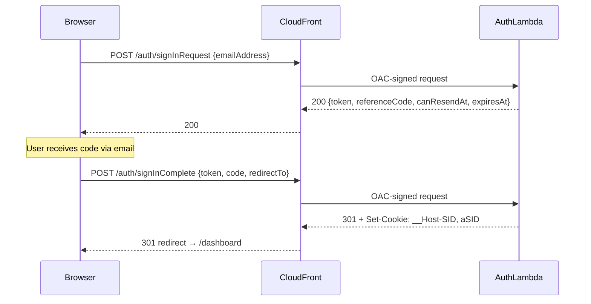
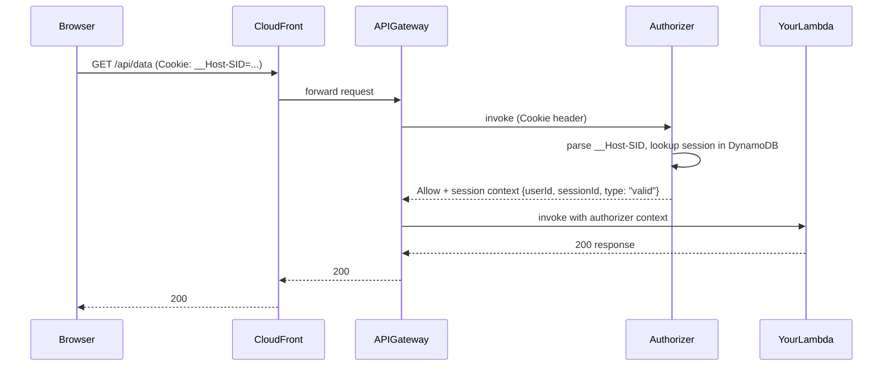

# @beesolve/auth-service

Email-code authentication system backed by AWS DynamoDB and EventBridge, deployable via CDK. Ships three Lambda handlers (API, authorizer, SDK bridge) and a framework-agnostic CDK construct that wires them together with API Gateway, DynamoDB tables, and IAM permissions.

## Purpose

The package implements a passwordless, email-code ("magic code") sign-in flow:

1. The user submits their email address → an OTP code is generated and an `EmailCodeAuth` EventBridge event is emitted (your consumer sends the email).
2. The user submits the code they received → the session is created and a `__Host-SID` cookie is set.
3. A Lambda authorizer validates the session cookie on every subsequent request and refreshes the session transparently.

The auth logic is framework-agnostic — the API handler uses the standard Web `Request`/`Response` API so it can be adapted to any runtime. The CDK construct manages all AWS wiring so consumers only need to provide a frontend URI and a stage name.

## Installation

```sh
npm install @beesolve/auth-service
# or
bun add @beesolve/auth-service
```

## Usage

### 1 — Infrastructure (CDK)

Import from `@beesolve/auth-service/cdk` and add the `Auth` construct to your stack.

```ts
import { Auth } from "@beesolve/auth-service/cdk";

const auth = new Auth(this, "Auth", {
  stage: "prod",
  frontendUri: "https://app.example.com",
  allowSignUp: true,
});
```

The construct provisions:

- **DynamoDB tables** — `Sessions` (with a userId GSI) and `Accounts` (with a reverse-lookup GSI).
- **Three Lambda functions** — the auth API handler, a Lambda authorizer, and an SDK bridge handler.
- **Function URL** (`authUrl`) — an IAM-protected endpoint for `signInRequest`, `signInComplete`, `resendCode`, and `signOut`. Access is restricted via CloudFront Origin Access Control (OAC).
- **Lambda@Edge** — computes `x-amz-content-sha256` for POST body SigV4 signing.
- **`authBehavior`** — a ready-to-use CloudFront `BehaviorOptions` object that wires the OAC origin and Lambda@Edge together.
- **`createAuthBehavior(scope)`** — creates the behavior with the edge function scoped to the provided construct, avoiding cross-stack CloudFormation export issues.
- **HTTP API** (`api`) — an API Gateway HTTP API with the Lambda authorizer attached, used for all routes that require a valid session.

#### Optional props

| Prop                            | Type               | Description                                                                                                 |
| ------------------------------- | ------------------ | ----------------------------------------------------------------------------------------------------------- |
| `alarms`                        | `EmailAlarms`      | Attach a `@beesolve/cdk-email-alarms` instance to report Lambda errors by email.                            |
| `eventBusArn`                   | `string`           | ARN of a custom EventBridge bus. Defaults to the `default` bus.                                             |
| `warmer`                        | `LambdaKeepActive` | Pass a `@beesolve/lambda-keep-active` instance to keep handlers warm.                                       |
| `eventSource`                   | `string`           | EventBridge source for all auth events. Defaults to `"beesolve.auth.api"`.                                  |
| `dataToken`                     | `boolean`          | When `true`, reads `__Host-DataToken` cookie on sign-in and fires a `DataToken` event. Defaults to `false`. |
| `logGroupProps`                 | `LogGroupProps`    | Override Lambda log group configuration. Defaults to `RemovalPolicy.DESTROY` / 2-week retention.            |
| `encryptionKey`                 | `IKey`             | Customer-managed KMS key for all data-at-rest resources (DynamoDB tables and SQS queues).                   |
| `contributorInsights`           | `boolean`          | CloudWatch Contributor Insights on DynamoDB tables. Defaults to `true` in prod.                             |
| `accessLogging`                 | `boolean`          | Access logging on the HTTP API. Creates a CloudWatch Log Group. Defaults to `true` in prod.                 |
| `authorizerReservedConcurrency` | `number`           | Reserved concurrent executions for the authorizer Lambda.                                                   |
| `sdkHandlerReservedConcurrency` | `number`           | Reserved concurrent executions for the SDK handler Lambda.                                                  |
| `resendCooldown`                | `Duration`         | Minimum time between code generations for the same email. Defaults to `Duration.seconds(60)`.               |
| `drainOnResend`                 | `boolean`          | Whether the previous OTP token is invalidated on resend. Defaults to `true`.                                |

> [!TIP]
> When deploying in a VPC, add a DynamoDB VPC Gateway Endpoint to keep traffic off the public internet. Gateway endpoints are free.

#### Adding authorized endpoints

```ts
import { Function } from "aws-cdk-lib/aws-lambda";

// Wire any Lambda behind the session-cookie authorizer
auth.addAuthorizedEndpoint({
  lambda: myApiLambda, // your Lambda
  path: "/api/{proxy+}", // optional, defaults to "/api/{proxy+}"
  methods: [HttpMethod.ANY], // optional, defaults to ANY
});
```

#### Granting SDK access

```ts
// Gives myLambda permission to invoke the SDK bridge and injects
// BEESOLVE_AUTH_SDK_HANDLER_ARN into its environment
auth.grantSdkAccess(myLambda);
```

#### Cross-stack usage

When the CloudFront distribution lives in a different stack, use `createAuthBehavior(scope)` instead of `authBehavior` to avoid CloudFormation cross-stack export issues with Lambda@Edge version ARNs:

```ts
// In a different stack from the Auth construct:
const behavior = auth.createAuthBehavior(this);
distribution.addBehavior("/auth/*", behavior.origin, behavior);
```

### 2 — Auth flow (client side)

The core design principle of this package is **same-domain, cookie-based authorization**. Your frontend, the auth endpoints, and your API all run behind a single CloudFront distribution at one domain (e.g. `app.example.com`). CloudFront routes `/auth/*` to the Lambda function URL and all other paths to your application and API.

Because every request — page loads, auth calls, API calls — shares the same origin, the `__Host-SID` session cookie set by the auth handler is automatically included by the browser on every subsequent API request. There is no cross-origin cookie handling, no token plumbing in your frontend code, and no CORS configuration needed between your app and the API.

Use `auth.authBehavior` to add the `/auth/*` behavior to your CloudFront distribution — it includes the OAC-signed origin and Lambda@Edge for body hashing. See [docs/cloudfront.md](docs/cloudfront.md) for a complete CDK example.

All endpoints expect `POST`, `Content-Type: application/json`.



#### Sign-in request

```ts
const res = await fetch("/auth/signInRequest", {
  method: "POST",
  headers: { "Content-Type": "application/json" },
  body: JSON.stringify({ emailAddress: "user@example.com" }),
});
const { token, referenceCode, canResendAt, expiresAt } = await res.json();
// save `token` for signInComplete or resendCode
```

This emits an `EmailCodeAuth` EventBridge event. Your event consumer should send the code to the user's email address.

#### Resend code

```ts
const res = await fetch("/auth/resendCode", {
  method: "POST",
  headers: { "Content-Type": "application/json" },
  body: JSON.stringify({ token }),
});
const { token: newToken, referenceCode, canResendAt, expiresAt } = await res.json();
// Replace stored token with newToken for signInComplete
```

Returns HTTP 429 if called before the cooldown (default 60s) has elapsed. The previous token is drained (invalidated) by default.

#### Sign-in complete

```ts
const res = await fetch("/auth/signInComplete", {
  method: "POST",
  headers: { "Content-Type": "application/json" },
  body: JSON.stringify({ token, code: "123456", redirectTo: "/dashboard" }),
});
// 301 redirect with __Host-SID and aSID cookies set
```

#### Sign out

```ts
await fetch("/auth/signOut", {
  method: "POST",
  headers: { "Content-Type": "application/json" },
  body: JSON.stringify({ redirectTo: "/" }),
});
// 301 redirect with __Host-SID cookie cleared
```

### 3 — SDK client (server-to-server)

Use `AuthClient` from `@beesolve/auth-service/sdk` inside Lambdas that have been granted SDK access via `grantSdkAccess`. The client reads `BEESOLVE_AUTH_SDK_HANDLER_ARN` from the environment automatically.

```ts
import { AuthClient } from "@beesolve/auth-service/sdk";

const auth = new AuthClient();

// Look up an account ID by email
const result = await auth.invoke({
  type: "accountIdByEmail",
  request: { emailAddress: "user@example.com" },
});
// result: { id: string } | null

// Create a new email account
const { id } = await auth.invoke({
  type: "newEmailAccount",
  request: { emailAddress: "new@example.com" },
});

// List active sessions for an account
const sessions = await auth.invoke({
  type: "sessionList",
  request: { accountId: id },
});

// Delete all sessions for an account (optionally keep one)
await auth.invoke({
  type: "deleteAllSessions",
  request: { accountId: id, exceptSessionId: "keep-this-one" },
});
```

### 4 — EventBridge events

All events are emitted on the configured event bus with source `"beesolve.auth.api"` (or the value of `eventSource`).

| `detail-type`          | Fired when                                | Key fields                                                                                                                                      |
| ---------------------- | ----------------------------------------- | ----------------------------------------------------------------------------------------------------------------------------------------------- |
| `EmailCodeAuth`        | Sign-in requested or code resent          | `accountId` (null for new users), `code`, `expiresAt`, `emailAddress`, `referenceCode`, `baseUri`, `cookies`, `acceptLanguage`, `requestOrigin` |
| `EmailAddressVerified` | New account created on first sign-in      | `accountId`, `emailAddress`, `verifiedAt`                                                                                                       |
| `DataToken`            | Sign-in complete with `dataToken` enabled | `accountId`, `emailAddress`, `dataToken`                                                                                                        |
| `SuccessfulAuth`       | _(reserved)_                              | `userId`                                                                                                                                        |
| `UnsuccessfulAuth`     | Sign-in failed (invalid/expired code)     | `emailAddress`, `reason`                                                                                                                        |
| `SessionInvalidated`   | Sign out                                  | `sessionId`                                                                                                                                     |
| `EmailInvitation`      | _(reserved)_                              | `emailAddress`, `baseUri`                                                                                                                       |

> **Important**: `EmailCodeAuth` is the integration point for email delivery. Subscribe an EventBridge rule to this event and implement your own email-sending logic (e.g. using `@beesolve/service-email`).

### 5 — Public cookie utilities

The main export (`@beesolve/auth-service`) exposes the cookie helpers used internally, which are useful for server-side middleware:

```ts
import {
  addSetCookies,
  parseSid,
  parseDataTokenCookie,
  toDataTokenCookie,
} from "@beesolve/auth-service";

// Parse the session ID from a Cookie header
const sid = parseSid(request.headers.get("cookie")); // string | null

// Parse the data token from a Cookie header
const dataToken = parseDataTokenCookie(request.headers.get("cookie")); // string | null

// Build a data-token Set-Cookie string (Max-Age 900s, SameSite=Strict)
const setCookie = toDataTokenCookie("my-token");

// Append __Host-SID and aSID Set-Cookie headers (pass maxAge=-1 to clear)
addSetCookies({
  headers: responseHeaders,
  cookies: [{ sid: sessionId, maxAge: 2592000 }],
});
```

### 6 — Error types

The main export also exposes the HTTP error classes used by the API handler:

```ts
import {
  BadRequestError,
  ForbiddenError,
  NotFoundError,
  UnauthorizedError,
} from "@beesolve/auth-service";
```

Each class extends `Error` and carries a `stringified: boolean` property that is `true` when the constructor received a non-string argument (the `message` is then `JSON.stringify(argument)`).

## FAQ

**Q: How does the authorizer work?**

The Lambda authorizer is attached to API Gateway as a `HttpLambdaAuthorizer` with a configurable result cache keyed on `$request.header.Cookie`. On each request it parses `__Host-SID` from the cookie, fetches the session from DynamoDB, and returns the session state to downstream Lambdas as `event.requestContext.authorizer.lambda.session`.

**The authorizer always returns `Effect: "Allow"`** — this is intentional. Session state (`"valid"`, `"expired"`, or `"invalid"`) is serialized into the authorizer context, and enforcement happens at the handler level. This design allows handlers to differentiate between anonymous, expired, and authenticated requests (e.g., showing different content or returning a specific error).

To enforce authentication in your handlers, use the `requireSessionV2` or `requireSessionV1` middleware (see below).

### 7 — Session middleware



The package exports middleware that validates the authorizer context and rejects unauthenticated requests. Import from `@beesolve/auth-service`:

```ts
import { requireSessionV2 } from "@beesolve/auth-service";

// For HTTP API (API Gateway v2)
export const fetch = requireSessionV2(async (request, session) => {
  // session.userId and session.sessionId are guaranteed valid here
  return new Response(JSON.stringify({ userId: session.userId }));
});
```

For REST API (API Gateway v1):

```ts
import { requireSessionV1 } from "@beesolve/auth-service";

export const fetch = requireSessionV1(async (request, session) => {
  return new Response(JSON.stringify({ userId: session.userId }));
});
```

Handlers that need anonymous access (e.g., public pages that show different content for logged-in users) should skip the middleware and read the authorizer context directly via `getAwsLambdaAuthorizerContext()` from `@beesolve/lambda-fetch-api`.

### 8 — Local development

In local dev (e.g., a Bun server), there is no API Gateway or Lambda authorizer. The `@beesolve/auth-service/dev` export provides `withDevSession` which wraps your fetch handler and injects a fake authorizer context, so `requireSessionV2` works without AWS:

```ts
import { withDevSession } from "@beesolve/auth-service/dev";
import { serve } from "bun";
import api from "./api";

const devApi = withDevSession(api.fetch, { userId: "user-123" });

serve({
  routes: {
    "/api/*": (request) => devApi(request),
  },
});
```

`withDevSession` accepts:

- `handler` — your fetch handler (`(request: Request) => Promise<Response>`)
- `session` — an object with at least `userId`. Optionally provide `sessionId` and `expiresAt`.

The wrapper runs your handler inside `runWithAwsContext` with a fake API Gateway v2 event containing the session, so all middleware that reads from the authorizer context works transparently.

**Q: What does `allowSignUp` control?**

When `allowSignUp: false`, users who complete the OTP flow but have no existing account receive a `400 BadRequest` (`"Email not registered."`). Set it to `true` to auto-create an account on first sign-in.

**Q: What is the `dataToken` feature?**

When `dataToken: true` is set on the CDK construct, the auth API reads a `__Host-DataToken` cookie from the sign-in request. On successful authentication it fires a `DataToken` EventBridge event containing the account ID, email, and the raw token value. This enables anonymous-to-authenticated data handoff (e.g. linking an anonymous shopping cart to a user account).

**Q: Can I use a custom EventBridge bus?**

Yes. Pass `eventBusArn` to the CDK construct. If omitted, the `default` event bus is used.

**Q: Why do client examples use relative URLs with no base address?**

Everything — the frontend, `/auth/*` endpoints, and `/api/*` routes — is served from a single CloudFront distribution on one domain. Because the browser is already on that domain, relative paths like `/auth/signInRequest` resolve to the same origin automatically. This also means `credentials: "include"` is unnecessary (same-origin requests include cookies by default) and there is zero CORS configuration. The `__Host-SID` cookie "just works" because the cookie's origin matches every request the browser makes.

**Q: Why does `signInComplete` return a redirect instead of JSON?**

The redirect (HTTP 301) sets `__Host-SID` and `aSID` cookies as part of the response. This allows the browser to store the session cookie in a single round-trip, then follow the redirect to the destination page.

**Q: Why are session cookies prefixed with `__Host-`?**

The `__Host-` prefix is a browser security mechanism. Browsers refuse to set or send a `__Host-` cookie unless it is `Secure`, has no `Domain` attribute, and has `Path=/`. This means:

- The cookie cannot be set by a subdomain or a non-HTTPS response — the server can be confident the value came from the exact first-party origin it set it on.
- `__Host-SID` is also `HttpOnly`, so JavaScript running in the browser (including third-party scripts) can never read the session token via `document.cookie`. Even if an XSS attack injects a script, the session token is not exfiltrated.

**Q: How does the frontend know if the user is logged in if `__Host-SID` is hidden from JavaScript?**

The `aSID` companion cookie is set alongside `__Host-SID` on every session change. Unlike `__Host-SID`, `aSID` is not `HttpOnly`, so client-side JavaScript can read it. It holds `1` when a session is active and `0` (or a negative `Max-Age`) when the session is cleared. Your frontend reads `aSID` to show or hide the logged-in UI state — it never sees the real session token.

**Q: What are the session expiry and refresh rules?**

Sessions expire after 30 days (`defaultMaxAge = 2_592_000` seconds). The authorizer refreshes the session on every request older than 15 seconds. A refresh creates a new session row and short-expires the old one, so the window where both are valid is at most 30 seconds.

**Q: Which account types are supported?**

Currently only `email`. The schema includes `phone` and `passkey` as reserved values for future extension, but no handlers implement them yet.

**Q: What is the reference code?**

A random 10-byte base64url string generated alongside every OTP (both initial sign-in and resend). It's returned in the API response and included in the `EmailCodeAuth` event so you can display it in the email subject or body. This helps users identify which email corresponds to their sign-in attempt when multiple codes are in-flight.

**Q: What format are date fields in?**

All date fields (`expiresAt`, `createdAt`, `startedAt`, `updatedAt`) returned by the authorizer and SDK are ISO 8601 timestamp strings. Use `Date.parse(value)` for comparisons or `new Date(value)` to convert.

**Q: How does OAC protect the auth endpoint?**

CloudFront Origin Access Control signs requests to the Lambda function URL using SigV4. The function URL has `AuthType: AWS_IAM`, so direct access without a valid SigV4 signature is rejected at the IAM layer — the Lambda is never invoked. For POST requests, a Lambda@Edge function computes the body hash (`x-amz-content-sha256`) automatically. This is already wired into `auth.authBehavior`.
