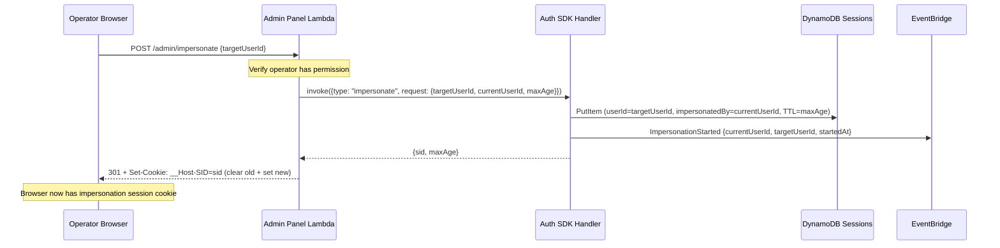
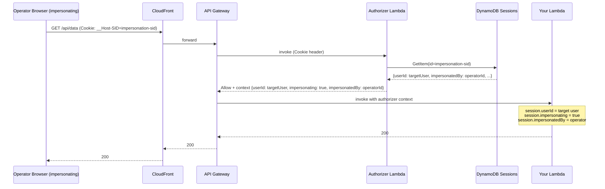
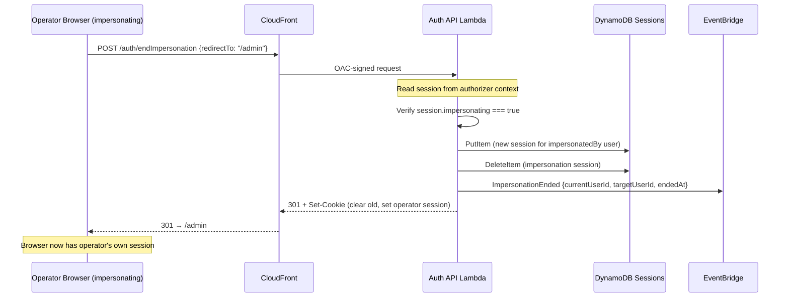
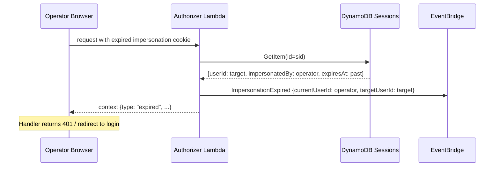

# Implementation Plan — Impersonation Feature

## Problem Statement

Operators (admins, support staff) need the ability to act as another user for debugging and support purposes. The current auth-service has no mechanism to create a session on behalf of another user while preserving an audit trail of who initiated it.

This plan adds impersonation support: an SDK command to start an impersonation session, a public auth endpoint to end it, new EventBridge events for audit, and a discriminated session context so downstream handlers can detect impersonation.

## Design Decisions

1. **`userId` stays as the effective user** — handlers that don't care about impersonation continue reading `session.userId` and work unchanged. The impersonation metadata is additive.

2. **Discriminated union in the authorizer context** — the session identity is `{ userId, impersonating: false }` or `{ userId, impersonating: true, impersonatedBy }`. Handlers pattern-match on `impersonating` to guard sensitive actions or show UI indicators.

3. **Flat `impersonatedBy` field in DynamoDB** — a single optional string on the session row. When absent → normal session. When present → the value is the account ID of whoever initiated the impersonation. The existing `userId` GSI still works (queries by effective user).

4. **SDK command to start, auth endpoint to end** — starting impersonation is a privileged server-to-server operation (SDK). Ending it is a browser action that needs to set a new cookie, so it's a public auth endpoint like `signOut`.

5. **Short-lived sessions** — impersonation sessions have a configurable max age (default 1 hour, max 4 hours) to limit exposure.

6. **Authorization is the caller's responsibility** — the auth-service is an authentication layer. It doesn't know who is an "admin." The calling service must verify the operator has permission to impersonate before invoking the SDK command.

7. **Breaking change to session context** — `ValidSession` changes from `{ userId, sessionId, expiresAt }` to a discriminated union. This is a `0.9.0` release. All consumers must update their session reading code.

## DynamoDB Schema Change

No table or index changes. A single optional attribute is added to session items:

| Attribute        | Type     | Description                                                                                     |
| ---------------- | -------- | ----------------------------------------------------------------------------------------------- |
| `impersonatedBy` | `string` | Account ID of the user who initiated the impersonation. Only present on impersonation sessions. |

Existing sessions without this field are naturally the `impersonating: false` case — zero migration needed.

## Authorizer Context Shape

The `validSession` object in the authorizer context changes from a flat object to a discriminated union:

```ts
// Before (0.8.x)
type ValidSession = {
  userId: string;
  sessionId: string;
  expiresAt: string;
};

// After (0.9.0)
type ValidSession =
  | { userId: string; sessionId: string; expiresAt: string; impersonating: false }
  | {
      userId: string;
      sessionId: string;
      expiresAt: string;
      impersonating: true;
      impersonatedBy: string;
    };
```

The authorizer builds this by checking the session row:

```ts
// In authorizer.ts, after fetching the session:
const validSession =
  session.impersonatedBy != null
    ? {
        userId: session.userId,
        sessionId,
        expiresAt,
        impersonating: true,
        impersonatedBy: session.impersonatedBy,
      }
    : { userId: session.userId, sessionId, expiresAt, impersonating: false };
```

## SDK Command — `impersonate`

A new command added to the SDK handler. Only callable by Lambdas with `grantSdkAccess`.

### Request

```ts
type ImpersonateCommand = {
  type: "impersonate";
  request: {
    targetUserId: string; // the user to impersonate
    currentUserId: string; // who is initiating (the operator)
    maxAge?: number; // session lifetime in seconds (default 3600, max 14400)
  };
  response: {
    sid: string; // session cookie value to set on the response
    maxAge: number; // cookie max-age in seconds
  };
};
```

### Implementation

```ts
if (type === "impersonate") {
  const parsed = v.parse(impersonateSchema, request);

  const maxAge = Math.min(parsed.maxAge ?? 3600, 14400); // cap at 4 hours

  const session = await sessions.createOne({
    userId: parsed.targetUserId,
    maxAge,
    data: {},
    impersonatedBy: parsed.currentUserId,
  });

  await events.putEvents({
    type: "ImpersonationStarted",
    detail: {
      currentUserId: parsed.currentUserId,
      targetUserId: parsed.targetUserId,
      startedAt: new Date().toISOString(),
    },
  });

  return { sid: session.id, maxAge };
}
```

### SDK Client Usage

```ts
import { AuthClient } from "@beesolve/auth-service/sdk";

const auth = new AuthClient();

// Start impersonation (in your admin panel backend Lambda)
const { sid, maxAge } = await auth.invoke({
  type: "impersonate",
  request: {
    targetUserId: "user-to-impersonate-id",
    currentUserId: "operator-account-id", // from the operator's own session
    maxAge: 3600, // optional, 1 hour
  },
});

// Set the cookie on the response to the operator's browser
const response = new Response(null, {
  status: 301,
  headers: {
    Location: "/dashboard",
  },
});
addSetCookies({
  headers: response.headers,
  cookies: [{ sid, maxAge }],
});
```

## Auth Endpoint — `POST /auth/endImpersonation`

A public endpoint accessible from the browser. Creates a new session for the original operator and clears the impersonation session.

### Request

```json
{
  "redirectTo": "/admin/dashboard"
}
```

### Behavior

1. Read the current session from the `__Host-SID` cookie (via the authorizer context).
2. Verify the session has `impersonating: true`. If not → 400 Bad Request.
3. Create a new normal session for `impersonatedBy` (the operator).
4. Delete the impersonation session.
5. Emit `ImpersonationEnded` event.
6. Respond with 301 redirect + `Set-Cookie` (clear old, set new).

### Implementation

```ts
export async function endImpersonation({
  sessions,
  events,
  requestBody,
  session, // ValidSession from authorizer context
  headers,
}: Dependencies): Promise<Response> {
  if (!session.impersonating) {
    throw new BadRequestError("Not in an impersonation session.");
  }

  const { redirectTo } = parseBody({ body: await requestBody(), schema });

  // Create a new session for the original operator
  const newSession = await sessions.createOne({
    userId: session.impersonatedBy,
    data: Sessions.dataFromCloudFrontHeaders(Object.fromEntries(headers.entries())),
  });

  // Delete the impersonation session
  await sessions.delete(session.sessionId);

  await events.putEvents({
    type: "ImpersonationEnded",
    detail: {
      currentUserId: session.impersonatedBy,
      targetUserId: session.userId,
      endedAt: new Date().toISOString(),
    },
  });

  return new Response(null, {
    status: 301,
    headers: addSetCookies({
      headers: new Headers({
        "Cache-Control": "no-store",
        Location: redirectTo ?? "/",
      }),
      cookies: [
        { sid: session.sessionId, maxAge: -1 }, // clear impersonation cookie
        { sid: newSession.id, maxAge: newSession.maxAge }, // set operator's cookie
      ],
    }),
  });
}
```

## EventBridge Events

Three new events added to the auth event bus:

| `detail-type`          | Fired when                                       | Key fields                                   |
| ---------------------- | ------------------------------------------------ | -------------------------------------------- |
| `ImpersonationStarted` | SDK `impersonate` command succeeds               | `currentUserId`, `targetUserId`, `startedAt` |
| `ImpersonationEnded`   | `/auth/endImpersonation` completes               | `currentUserId`, `targetUserId`, `endedAt`   |
| `ImpersonationExpired` | Authorizer detects expired impersonation session | `currentUserId`, `targetUserId`, `expiredAt` |

### Event Schemas

```ts
interface ImpersonationStarted {
  readonly type: "ImpersonationStarted";
  readonly detail: {
    readonly currentUserId: string; // who initiated
    readonly targetUserId: string; // who is being impersonated
    readonly startedAt: string; // ISO timestamp
  };
}

interface ImpersonationEnded {
  readonly type: "ImpersonationEnded";
  readonly detail: {
    readonly currentUserId: string;
    readonly targetUserId: string;
    readonly endedAt: string;
  };
}

interface ImpersonationExpired {
  readonly type: "ImpersonationExpired";
  readonly detail: {
    readonly currentUserId: string;
    readonly targetUserId: string;
    readonly expiredAt: string;
  };
}
```

### `ImpersonationExpired` via DynamoDB Streams

When `impersonationExpiredEvents` is enabled in CDK, a stream Lambda processes session deletions (both TTL-based and explicit):

```ts
// Stream handler (simplified)
export async function handler(event: DynamoDBStreamEvent) {
  for (const record of event.Records) {
    if (record.eventName !== "REMOVE") continue;

    const oldImage = record.dynamodb?.OldImage;
    if (oldImage == null) continue;

    const impersonatedBy = oldImage.impersonatedBy?.S;
    if (impersonatedBy == null) continue; // not an impersonation session

    const userId = oldImage.userId?.S;
    const expiresAt = oldImage.expiresAt?.N;

    await events.putEvents({
      type: "ImpersonationExpired",
      detail: {
        currentUserId: impersonatedBy,
        targetUserId: userId,
        expiredAt: new Date(Number(expiresAt) * 1000).toISOString(),
      },
    });
  }
}
```

This approach keeps the authorizer lightweight (no EventBridge dependency) and only adds cost when the feature is explicitly opted into.

## Flows

### Start Impersonation



### Impersonated Request



### End Impersonation



### Impersonation Session Expires



## Handler Usage Examples

### Detecting impersonation in a handler

```ts
import { requireSessionV2, type ValidSession } from "@beesolve/auth-service";

export const fetch = requireSessionV2(async (request, session) => {
  // session.userId is always the effective user (the target)
  const data = await loadUserData(session.userId);

  if (session.impersonating) {
    // Log for audit, show banner, or restrict actions
    console.log(`Impersonated by ${session.impersonatedBy}`);
  }

  return new Response(JSON.stringify(data));
});
```

### Blocking sensitive actions during impersonation

```ts
export const fetch = requireSessionV2(async (request, session) => {
  if (session.impersonating) {
    return new Response(
      JSON.stringify({ message: "Cannot perform this action while impersonating." }),
      { status: 403, headers: { "Content-Type": "application/json" } },
    );
  }

  // ... delete account, change email, etc.
});
```

### Admin panel — starting impersonation

```ts
import { AuthClient } from "@beesolve/auth-service/sdk";
import { requireSessionV2 } from "@beesolve/auth-service";
import { addSetCookies } from "@beesolve/auth-service";

const auth = new AuthClient();

export const fetch = requireSessionV2(async (request, session) => {
  // Your own permission check — auth-service doesn't enforce this
  if (!(await isOperator(session.userId))) {
    return new Response("Forbidden", { status: 403 });
  }

  const { targetUserId } = await request.json();

  const { sid, maxAge } = await auth.invoke({
    type: "impersonate",
    request: {
      targetUserId,
      currentUserId: session.userId,
      maxAge: 3600,
    },
  });

  return new Response(null, {
    status: 301,
    headers: addSetCookies({
      headers: new Headers({
        "Cache-Control": "no-store",
        Location: "/",
      }),
      cookies: [
        { sid: session.sessionId, maxAge: -1 }, // clear operator's session
        { sid, maxAge }, // set impersonation session
      ],
    }),
  });
});
```

### Frontend — end impersonation button

```ts
async function endImpersonation() {
  await fetch("/auth/endImpersonation", {
    method: "POST",
    headers: { "Content-Type": "application/json" },
    body: JSON.stringify({ redirectTo: "/admin/users" }),
  });
  // Browser follows 301 redirect back to admin panel
}
```

## `requireSession` Middleware Changes

The `ValidSession` type becomes a discriminated union. The middleware itself doesn't change behavior — it still rejects invalid/expired sessions. But the type signature changes:

```ts
// Before
export type ValidSession = {
  userId: string;
  sessionId: string;
  expiresAt: string;
};

// After
export type ValidSession =
  | { userId: string; sessionId: string; expiresAt: string; impersonating: false }
  | {
      userId: string;
      sessionId: string;
      expiresAt: string;
      impersonating: true;
      impersonatedBy: string;
    };
```

Consumers that only access `session.userId` will get a type error because TypeScript can't narrow the union without checking `impersonating`. Two upgrade paths:

1. **Pattern match** (recommended for handlers that care):

   ```ts
   if (session.impersonating) {
     // session.impersonatedBy available here
   }
   ```

2. **Access common fields directly** — `userId`, `sessionId`, `expiresAt` are present on both variants, so `session.userId` still works without narrowing. The type error only appears if the consumer destructures or spreads the entire session object.

## Session Schema Changes (`session.ts`)

```ts
// Add to authorizerSchema:
const authorizerSchema = v.object({
  id: v.string(),
  sessionId: v.string(),
  userId: v.string(),
  impersonatedBy: v.optional(v.string()), // ← NEW
  startedAt: v.pipe(v.string(), v.isoTimestamp()),
  createdAt: v.pipe(v.string(), v.isoTimestamp()),
  expiresAt: v.pipe(
    v.number(),
    v.transform((value) => new Date(value * 1000).toISOString()),
    v.isoTimestamp(),
  ),
});

// Sessions.createOne gains an optional impersonatedBy param:
readonly createOne = async (props: {
  readonly userId: string;
  readonly maxAge?: number;
  readonly data: NewSession["data"];
  readonly impersonatedBy?: string; // ← NEW
}) => { /* ... */ };
```

## CDK Changes

Minimal — no new tables or indexes. Changes:

1. **Auth API Lambda** handles the new `/auth/endImpersonation` route (no CDK change, just code in the handler).
2. **Optional CDK prop** for configuring max impersonation duration:

```ts
/**
 * Maximum allowed impersonation session duration.
 * SDK callers can request up to this value. Defaults to 4 hours.
 *
 * @default Duration.hours(4)
 */
readonly maxImpersonationDuration?: Duration;
```

3. **Optional CDK prop** for DynamoDB Streams-based expiration events:

```ts
/**
 * When true, enables DynamoDB Streams on the Sessions table and deploys
 * a Lambda that emits `ImpersonationExpired` events when impersonation
 * sessions are TTL-deleted. Adds cost (Stream read units + Lambda invocations).
 *
 * @default false
 */
readonly impersonationExpiredEvents?: boolean;
```

When enabled, the construct creates:

- A DynamoDB Stream (NEW_AND_OLD_IMAGES) on the Sessions table
- A Lambda that filters for `eventName: "REMOVE"` items where `impersonatedBy` was present
- EventBridge `events:PutEvents` permission for the stream Lambda

## Breaking Changes (0.8.x → 0.9.0)

| Change                                                    | Impact                                                                                                                             |
| --------------------------------------------------------- | ---------------------------------------------------------------------------------------------------------------------------------- |
| `ValidSession` becomes a discriminated union              | All consumers reading session must handle or acknowledge the union. `session.userId` still accessible without narrowing.           |
| `requireSessionV2` / `requireSessionV1` handler signature | Same — receives `ValidSession` but type is wider now.                                                                              |
| Authorizer context JSON shape                             | Adds `impersonating` and optionally `impersonatedBy` fields. Existing consumers that only destructure known fields are unaffected. |

## Task Breakdown

### Task 1: Add `impersonatedBy` to session schema and `createOne`

- Add `impersonatedBy: v.optional(v.string())` to `authorizerSchema` and full `schema`
- Add optional `impersonatedBy` param to `Sessions.createOne` and `toNewSession`
- Include in `getOne` projection expression

### Task 2: Update authorizer to build discriminated context

- Read `impersonatedBy` from session row
- Build `validSession` as discriminated union
- (Optional) Emit `ImpersonationExpired` event on expired impersonation sessions

### Task 3: Update `requireSession` and `ValidSession` type

- Change `validSessionSchema` to a discriminated union with valibot `v.variant`
- Export updated `ValidSession` type

### Task 4: Add `impersonate` SDK command

- Add schema, types, and handler logic in `sdkHandler.ts`
- Emit `ImpersonationStarted` event
- Enforce max age cap

### Task 5: Implement `/auth/endImpersonation` endpoint

- New handler `src/handlers/endImpersonation.ts`
- Wire into `api.ts` router
- Emit `ImpersonationEnded` event
- Return redirect with cookie swap

### Task 6: Add event types

- Add `ImpersonationStarted`, `ImpersonationEnded`, `ImpersonationExpired` to `src/events.ts` and consumer-facing `events.ts`
- Add type guards and schema validation

### Task 7: CDK changes

- Add `maxImpersonationDuration` prop, pass as env var to SDK handler
- Add optional `impersonationExpiredEvents` prop:
  - When `true`: enables DynamoDB Streams on the Sessions table + a Lambda that filters for TTL-deleted items with `impersonatedBy` and emits `ImpersonationExpired` to EventBridge
  - When `false` (default): no stream, no extra Lambda, no expired event

### Task 8: Tests

- Unit test `impersonate` SDK command
- Unit test `endImpersonation` handler
- Unit test authorizer discriminated context building
- Unit test `requireSessionV2` with both variants

### Task 9: Update documentation

- Update README session middleware section
- Add impersonation section to README
- Update events table
- Update SDK client examples

## Checklist

- [ ] Task 1: Session schema + `createOne` changes
- [ ] Task 2: Authorizer context discrimination
- [ ] Task 3: `requireSession` / `ValidSession` type update
- [ ] Task 4: `impersonate` SDK command
- [ ] Task 5: `/auth/endImpersonation` endpoint
- [ ] Task 6: Event types (Started, Ended, Expired)
- [ ] Task 7: CDK prop for max duration
- [ ] Task 8: Tests
- [ ] Task 9: Documentation update

## Resolved Decisions

1. **`ImpersonationExpired` event** — deferred from the authorizer. Will be implemented via DynamoDB Streams: a separate Lambda subscribes to session table TTL deletions, checks for `impersonatedBy`, and emits the event. This is an **optional CDK setting** (`impersonationExpiredEvents: true`) since it adds a Stream + Lambda (cost and complexity). Not required for core impersonation functionality.

2. **`endImpersonation` routing** — reads `__Host-SID` directly from the cookie and looks up the session in DynamoDB within the handler. Same pattern as `signOut`. Stays on the auth function URL behind CloudFront OAC, no additional Lambda or API Gateway route needed.

3. **Session refresh** — impersonation sessions use the same refresh/rotation mechanism as normal sessions. Same 15s drift, same rotation logic. The max age cap (default 1h, max 4h) is enforced at creation time and carried through refreshes. No special-casing needed.
