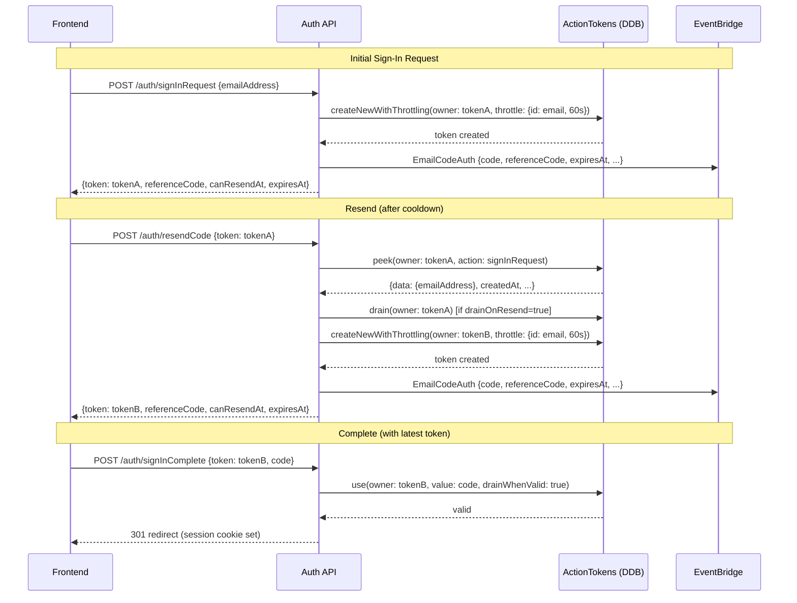

# Implementation Plan — Resend Code Feature

## Problem Statement

Users need to re-request OTP codes when emails are delayed. The current flow has no resend mechanism — users must restart the entire sign-in flow. This plan adds a `/auth/resendCode` endpoint with cooldown enforcement, a reference code for email identification, and configurable behavior.

## Requirements

1. Code can only be resent after a configurable cooldown (default 60s) since the last code generation
2. Resend generates a **new token** (owner) and a new OTP. The old token can optionally be drained (`drainOnResend` CDK setting, default `true`)
3. A **reference code** (`randomBytes(10).toString("base64url")`) is generated alongside every OTP (initial + resend) — returned to frontend and included in the `EmailCodeAuth` event for email display
4. The resend endpoint accepts the existing `token`, uses `peek()` to read the email address from `data`, then issues a new token via `createNewWithThrottling`
5. The initial `signInRequest` is also migrated to use `createNewWithThrottling` for consistent per-email throttling
6. Both endpoints return `{ token, referenceCode, canResendAt, expiresAt }` so the frontend can show cooldown timers and code expiry
7. `TokenThrottledError` is mapped to HTTP 429 in the error handler

## Configuration (CDK Props → Env Vars)

| CDK Prop | Env Var | Type | Default | Description |
|----------|---------|------|---------|-------------|
| `resendCooldown` | `RESEND_COOLDOWN` | `Duration` → seconds string | `Duration.seconds(60)` | Minimum time between code generations per email |
| `drainOnResend` | `DRAIN_ON_RESEND` | `boolean` → `"true"/"false"` | `true` | Whether the previous token is drained on resend |

## Event Schema Change

`EmailCodeAuth` event detail gains a new field:

```ts
interface EmailCodeAuth {
  readonly type: "EmailCodeAuth";
  readonly detail: {
    // ... existing fields ...
    readonly code: string;
    readonly expiresAt: string;
    readonly emailAddress: string;
    readonly referenceCode: string; // ← NEW
    // ...
  };
}
```

## API Contracts

### POST /auth/signInRequest (modified response)

**Request** (unchanged):
```json
{ "emailAddress": "user@example.com" }
```

**Response** (new fields):
```json
{
  "token": "base64url-random-32-bytes",
  "referenceCode": "base64url-random-10-bytes",
  "canResendAt": "2026-06-02T17:12:00.000Z",
  "expiresAt": "2026-06-02T17:21:00.000Z"
}
```

### POST /auth/resendCode (new endpoint)

**Request**:
```json
{ "token": "existing-token-from-signInRequest" }
```

**Response** (success):
```json
{
  "token": "new-base64url-random-32-bytes",
  "referenceCode": "base64url-random-10-bytes",
  "canResendAt": "2026-06-02T17:13:00.000Z",
  "expiresAt": "2026-06-02T17:22:00.000Z"
}
```

**Error responses**:
- `429` — throttled (cooldown not elapsed): `{ "message": "Too many requests. Try again later.", "type": "throttled" }`
- `400` — token not found / expired / used up: `{ "message": "...", "type": "badRequest" }`

## Architecture Flow



## Task Breakdown

### Task 1: Add `referenceCode` to `EmailCodeAuth` event schema and `src/events.ts`

**Objective**: Extend the EmailCodeAuth event to include the reference code field.

**Implementation**:
- In `src/events.ts`: add `readonly referenceCode: string` to the `EmailCodeAuth` interface detail
- In `events.ts` (consumer-facing): add `referenceCode: v.string()` to `emailCodeAuthSchema.detail`
- Update the `EmailCodeAuthDetail` type export

**Test requirements**:
- Existing type checks pass (`bun run type-check`)

**Demo**: The event schema now accepts and types a `referenceCode` field. Existing consumers continue to compile (the field is additive).

---

### Task 2: Modify `signInRequest` to use `createNewWithThrottling` and return new fields

**Objective**: The initial sign-in request now enforces per-email throttling, generates a reference code, and returns `{ token, referenceCode, canResendAt, expiresAt }`.

**Implementation**:
- In `src/handlers/signInRequest.ts`:
  - Update `Dependencies` interface: add `resendCooldownSeconds: number`
  - Change `actionTokens` type from `Pick<ActionTokensClient, "createNew">` to `Pick<ActionTokensClient, "createNewWithThrottling">`
  - Generate `referenceCode = randomBytes(10).toString("base64url")`
  - Replace `actionTokens.createNew(...)` with `actionTokens.createNewWithThrottling({ ..., throttle: { id: emailAddress, windowSeconds: resendCooldownSeconds } })`
  - Include `referenceCode` in the `events.putEvents` call
  - Compute `canResendAt = new Date(Date.now() + resendCooldownSeconds * 1000).toISOString()`
  - Return `{ token, referenceCode, canResendAt, expiresAt: expiresAt.toISOString() }`

- In `api.ts`:
  - Add `RESEND_COOLDOWN` to `envSchema` (optional, default `"60"`)
  - Pass `resendCooldownSeconds: env.RESEND_COOLDOWN` to `signInRequest`

**Test requirements**:
- Unit test `tests/signInRequest.test.ts`:
  - Mock `actionTokens.createNewWithThrottling` and `events.putEvents`
  - Assert response contains all 4 fields
  - Assert `referenceCode` is passed in the event detail
  - Assert throttle params: `{ id: emailAddress, windowSeconds: 60 }`

**Demo**: `POST /auth/signInRequest` returns `{ token, referenceCode, canResendAt, expiresAt }` and emits event with `referenceCode`. Repeated calls within 60s return HTTP 429.

---

### Task 3: Add `TokenThrottledError` → HTTP 429 mapping in `api.ts`

**Objective**: Map `TokenThrottledError` from action-tokens to a 429 response.

**Implementation**:
- In `api.ts`:
  - Import `TokenThrottledError` from `@beesolve/action-tokens/model`
  - Add to `errorResponseMap`: `[TokenThrottledError, { status: 429, type: "throttled" }]`

**Test requirements**:
- Integration: calling `signInRequest` twice within cooldown returns 429 with `{ message: "...", type: "throttled" }`

**Demo**: Rapid consecutive sign-in requests for the same email return HTTP 429 instead of 500.

---

### Task 4: Implement `/auth/resendCode` handler

**Objective**: New handler that peeks the existing token, optionally drains it, generates a new token+code+referenceCode, and returns fresh credentials.

**Implementation**:
- Create `src/handlers/resendCode.ts`:

```ts
import { randomBytes } from "node:crypto";
import type { ActionTokensClient } from "@beesolve/action-tokens/sdk";
import {
  ExpiredTokenError,
  TokenAlreadyUsedUpError,
  TokenDoesNotExistError,
} from "@beesolve/action-tokens/model";
import * as v from "valibot";
import type { Events } from "../events.ts";
import { parseBody } from "../request.ts";
import { generateOTP } from "../util.ts";
import { BadRequestError } from "../errors.ts";

interface Dependencies {
  readonly actionTokens: Pick<ActionTokensClient, "peek" | "drain" | "createNewWithThrottling">;
  readonly events: Pick<Events, "putEvents">;
  readonly requestBody: () => Promise<any>;
  readonly otpExpirySeconds: number;
  readonly resendCooldownSeconds: number;
  readonly drainOnResend: boolean;
  readonly baseUri: string;
  readonly cookies: Record<string, string>;
  readonly acceptLanguage: string | null;
  readonly requestOrigin: string | null;
}

const schema = v.object({
  token: v.string(),
});

export async function resendCode({
  actionTokens,
  events,
  requestBody,
  otpExpirySeconds,
  resendCooldownSeconds,
  drainOnResend,
  baseUri,
  cookies,
  acceptLanguage,
  requestOrigin,
}: Dependencies): Promise<Response> {
  const { token: oldToken } = parseBody({ body: await requestBody(), schema });

  // Peek the existing token to get emailAddress from data
  const existing = await actionTokens.peek({
    owner: oldToken,
    action: "signInRequest",
  }).catch((error) => {
    if (
      error instanceof TokenDoesNotExistError ||
      error instanceof ExpiredTokenError ||
      error instanceof TokenAlreadyUsedUpError
    ) {
      throw new BadRequestError("Token not found or expired.");
    }
    throw error;
  });

  const emailAddress = (existing.data as { emailAddress?: string })?.emailAddress;
  if (!emailAddress) throw new BadRequestError("Invalid token data.");

  // Optionally drain the old token
  if (drainOnResend) {
    await actionTokens.drain({ owner: oldToken, action: "signInRequest" });
  }

  // Generate new credentials
  const newToken = randomBytes(32).toString("base64url");
  const code = generateOTP();
  const referenceCode = randomBytes(10).toString("base64url");

  const expiresAt = new Date();
  expiresAt.setUTCSeconds(expiresAt.getUTCSeconds() + otpExpirySeconds);

  // Create with throttling (enforces per-email cooldown)
  await actionTokens.createNewWithThrottling({
    action: "signInRequest",
    data: { emailAddress },
    expiresAt,
    overwrite: false,
    owner: newToken,
    remainingUses: 3,
    value: code,
    throttle: { id: emailAddress, windowSeconds: resendCooldownSeconds },
  });

  await events.putEvents({
    type: "EmailCodeAuth",
    detail: {
      code,
      referenceCode,
      emailAddress,
      expiresAt: expiresAt.toISOString(),
      accountId: null,
      baseUri,
      cookies,
      acceptLanguage,
      requestOrigin,
    },
  });

  const canResendAt = new Date(Date.now() + resendCooldownSeconds * 1000).toISOString();

  return new Response(
    JSON.stringify({ token: newToken, referenceCode, canResendAt, expiresAt: expiresAt.toISOString() }),
    { status: 200, headers: { "content-type": "application/json" } },
  );
}
```

**Test requirements**:
- Unit test `tests/resendCode.test.ts`:
  - Happy path: peek returns valid token → drain called (when setting true) → new token created → event emitted → response has all fields
  - Drain disabled: peek returns valid → drain NOT called → new token created
  - Token not found: peek throws `TokenDoesNotExistError` → 400 response
  - Throttled: `createNewWithThrottling` throws `TokenThrottledError` → 429 response (handled by error mapping)

**Demo**: `POST /auth/resendCode { token }` returns `{ token, referenceCode, canResendAt, expiresAt }` with a fresh code, and the old token is drained.

---

### Task 5: Wire `resendCode` handler into `api.ts` router

**Objective**: Register the `/auth/resendCode` route in the main API handler.

**Implementation**:
- In `api.ts`:
  - Import `resendCode` from `./src/handlers/resendCode.ts`
  - Add `RESEND_COOLDOWN` and `DRAIN_ON_RESEND` to `envSchema`:
    ```ts
    RESEND_COOLDOWN: v.optional(v.pipe(v.string(), v.transform(Number)), "60"),
    DRAIN_ON_RESEND: v.optional(v.pipe(v.string(), v.transform((v) => v === "true")), "true"),
    ```
  - Add route block after `signInComplete`:
    ```ts
    if (path === "/auth/resendCode") {
      // same cookie/header parsing as signInRequest
      return await resendCode({
        actionTokens,
        events,
        requestBody,
        otpExpirySeconds: env.OTP_EXPIRY,
        resendCooldownSeconds: env.RESEND_COOLDOWN,
        drainOnResend: env.DRAIN_ON_RESEND,
        baseUri: env.BASE_URI,
        cookies,
        acceptLanguage,
        requestOrigin,
      });
    }
    ```

**Test requirements**:
- Type check passes
- Manual/integration: calling the route returns expected JSON

**Demo**: The `/auth/resendCode` endpoint is live and routes correctly. End-to-end: signInRequest → resendCode → signInComplete all work in sequence.

---

### Task 6: Add CDK props and pass env vars to auth handler

**Objective**: Add `resendCooldown` and `drainOnResend` CDK props, pass them as environment variables.

**Implementation**:
- In `cdk.ts`:
  - Add to props interface:
    ```ts
    /**
     * Minimum time between code generations for the same email address.
     * Applies to both the initial sign-in request and resend.
     *
     * @default Duration.seconds(60)
     */
    readonly resendCooldown?: Duration;
    /**
     * Whether the previous OTP token is drained (invalidated) when a new
     * code is resent. When false, both old and new codes remain valid until
     * they expire or are used up.
     *
     * @default true
     */
    readonly drainOnResend?: boolean;
    ```
  - Add to `authHandlerEnv`:
    ```ts
    RESEND_COOLDOWN: String(Math.round((props.resendCooldown ?? Duration.seconds(60)).toSeconds())),
    DRAIN_ON_RESEND: String(props.drainOnResend ?? true),
    ```

**Test requirements**:
- Type check passes
- CDK synth produces the env vars in the Lambda environment

**Demo**: Deploying with `resendCooldown: Duration.seconds(90)` results in `RESEND_COOLDOWN=90` in the Lambda environment.

---

### Task 7: Update documentation

**Objective**: Update README and event docs to reflect the new endpoint, response format, and CDK props.

**Implementation**:
- In `README.md`:
  - Add `resendCooldown` and `drainOnResend` to the "Optional props" table
  - Add "Resend code" section under "2 — Auth flow (client side)" with example:
    ```ts
    const res = await fetch(`${authUrl}/auth/resendCode`, {
      method: "POST",
      headers: { "Content-Type": "application/json" },
      body: JSON.stringify({ token }),
      credentials: "include",
    });
    const { token: newToken, referenceCode, canResendAt, expiresAt } = await res.json();
    // Replace stored token with newToken for signInComplete
    ```
  - Update the `signInRequest` example to show new response fields
  - Update the EventBridge events table: add `referenceCode` to EmailCodeAuth key fields
  - Add FAQ: "What is the reference code?" explaining it's for email identification UX

- In `events.ts` (consumer-facing): the schema change from Task 1 serves as API documentation

- In `docs/` (optional): add a note in any relevant doc about the resend flow

**Test requirements**:
- Documentation is accurate and consistent with code

**Demo**: README shows the complete resend flow and all new response fields.

---

## Checklist

- [ ] Task 1: Add `referenceCode` to EmailCodeAuth event schema
- [ ] Task 2: Modify `signInRequest` to use throttling + return new fields
- [ ] Task 3: Map `TokenThrottledError` → HTTP 429
- [ ] Task 4: Implement `resendCode` handler
- [ ] Task 5: Wire handler into `api.ts` router
- [ ] Task 6: Add CDK props + env vars
- [ ] Task 7: Update documentation (README, events table, FAQ)

## Breaking Changes

- **`signInRequest` response shape changes**: adds `referenceCode`, `canResendAt`, `expiresAt` fields. Existing clients that only read `token` are unaffected (additive).
- **`signInRequest` now throttles per-email**: rapid requests for the same email within cooldown return 429 instead of succeeding. This is a behavioral change for clients that relied on re-requesting without cooldown.
- **`EmailCodeAuth` event gains `referenceCode`**: email consumers should be updated to display it. The field is additive so existing consumers won't break but won't show the reference code until updated.

## Migration Notes

- Bump minor version (`0.7.0`) — new feature, additive API changes
- Email template consumers should add `referenceCode` display
- Frontend should update to read new response fields and store `canResendAt` for resend button UX
