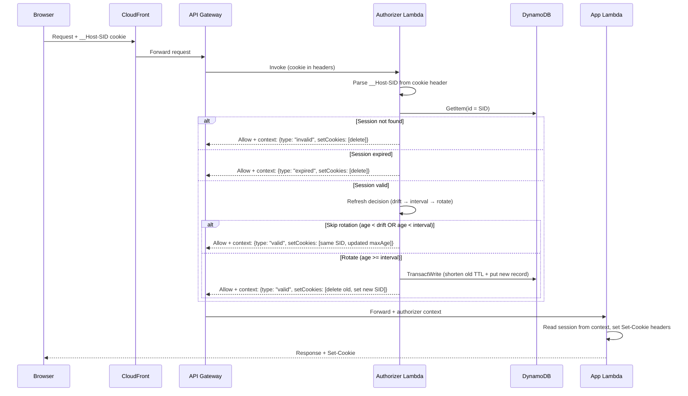
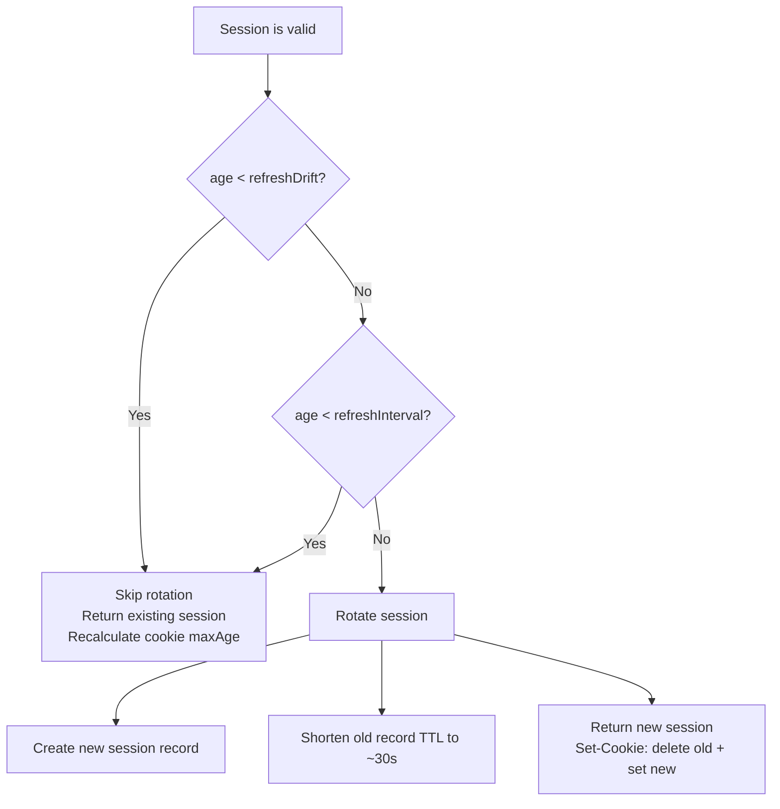

# Session Authorizer Lifecycle

This document describes the full request lifecycle for session-based authentication in `@beesolve/auth-service`, covering both the Lambda authorizer pattern and the in-process pattern.

## Request Lifecycle

### Sequence Diagram



### Step-by-Step

1. **Browser sends request** with `__Host-SID` cookie (the session token).

2. **CloudFront forwards** to API Gateway (or directly to Lambda for in-process pattern).

3. **Cookie parsing** — Extract `__Host-SID` value from the `Cookie` header.
   - Missing cookie header → `{type: "invalid"}`, no cookies to clear.
   - Missing `__Host-SID` in header → `{type: "invalid"}`, no cookies to clear.

4. **Session lookup** — `GetItem` from DynamoDB using the SID as the partition key.
   - Not found → `{type: "invalid"}`, delete cookie (`maxAge: -1`).

5. **Expiry check** — Compare current time against `expiresAt`.
   - Expired → `{type: "expired"}`, delete cookie.

6. **Refresh decision** — The three-step evaluation described below.

7. **Response** — Authorizer returns an IAM Allow policy with session context serialized in `context.session`. The downstream Lambda reads this context and sets `Set-Cookie` headers on the response.

## Refresh Decision Tree



Where `age = now - session.createdAt` (time since the current session record was created).

## Configuration Knobs

| Setting          | CDK Prop                 | Env Var                    | Default          | Unit         | Purpose                                                                      |
| ---------------- | ------------------------ | -------------------------- | ---------------- | ------------ | ---------------------------------------------------------------------------- |
| Session lifetime | `sessionDuration`        | `SESSION_MAX_AGE`          | 30 days          | seconds      | Total session lifetime before DynamoDB TTL expires it                        |
| Drift guard      | `sessionRefreshDrift`    | `SESSION_REFRESH_DRIFT`    | 15 seconds       | milliseconds | Browser race condition window — sessions younger than this are never rotated |
| Refresh interval | `sessionRefreshInterval` | `SESSION_REFRESH_INTERVAL` | 1 hour           | milliseconds | Minimum time between session rotations                                       |
| Authorizer cache | `authorizerCache`        | (API Gateway config)       | "balanced" (45s) | —            | How long API Gateway caches authorizer decisions                             |

For the in-process pattern (`SessionAuthorizer`), env vars are prefixed with `BEESOLVE_AUTH_` (e.g. `BEESOLVE_AUTH_SESSION_REFRESH_INTERVAL`).

## Behavior Matrix

How different combinations of cache mode and refresh interval interact:

| Cache Mode                                 | Authorizer Runs | Rotation Frequency | Use Case                                                                          |
| ------------------------------------------ | --------------- | ------------------ | --------------------------------------------------------------------------------- |
| `"balanced"` (45s) + default interval (1h) | Every 45s       | Every 1h           | Standard API apps — cache limits authorizer invocations, interval limits rotation |
| `"relaxed"` (1h) + default interval (1h)   | Every 1h        | Every 1h           | Low-cost API apps — cache and interval are aligned                                |
| `"disabled"` + default interval (1h)       | Every request   | Every 1h           | SSR apps — authorizer runs always, but rotation is infrequent                     |
| `"disabled"` + short interval (5m)         | Every request   | Every 5m           | Higher-security SSR apps — more frequent rotation                                 |
| `"immediate"` (0s) + default interval (1h) | Every request   | Every 1h           | Same as "disabled" but with identity source (requires cookie present)             |

### Key insight

With authorizer caching enabled, the cache TTL is the dominant factor — the authorizer rarely runs, so the refresh interval only matters when it does. With caching disabled, the refresh interval is the sole control over rotation frequency.

## Cookie Behavior

Two cookies are set on every response:

| Cookie       | Purpose                                                   | Attributes                                  |
| ------------ | --------------------------------------------------------- | ------------------------------------------- |
| `__Host-SID` | Session token (actual credential)                         | `HttpOnly; Secure; SameSite=Strict; Path=/` |
| `aSID`       | Client-side auth state hint (`1` = active, `0` = cleared) | `Secure; SameSite=Strict; Path=/`           |

### Set-Cookie scenarios

| Condition                               | Cookies Set                                                         |
| --------------------------------------- | ------------------------------------------------------------------- |
| Skip rotation (drift or interval guard) | `__Host-SID={same}; Max-Age={remaining}`                            |
| Rotation                                | `__Host-SID={old}; Max-Age=-1` + `__Host-SID={new}; Max-Age={full}` |
| Invalid/expired session                 | `__Host-SID={old}; Max-Age=-1`                                      |

## Patterns

### Lambda Authorizer Pattern (API Gateway)

Used by standard API apps. The authorizer Lambda runs as an API Gateway authorizer, caching decisions based on the cookie value.

```
Browser → CloudFront → API Gateway → Authorizer Lambda → App Lambda
```

Session context is passed from authorizer to app via `event.requestContext.authorizer.lambda.session`.

### In-Process Pattern (SSR / SvelteKit)

Used by SSR apps where the authorizer and app run in the same Lambda. The `SessionAuthorizer` class performs session resolution directly, avoiding the API Gateway authorizer overhead.

```
Browser → CloudFront → App Lambda (with SessionAuthorizer)
```

The `createInProcessSessionHandle()` SvelteKit handle lazy-imports `SessionAuthorizer` and resolves the session on every request. Set-Cookie headers are added directly to the response.
